# Inventario de UI — vistas y componentes a diseñar

Este documento es el **encargo al equipo de diseño**. Enumera, de forma exhaustiva, todas las
pantallas y componentes visuales que el MMI del RCP necesita para cubrir lo que hoy cubren dos
sistemas legacy distintos:

- **Ravis 1.3** (AMS-Gematronik, 2003) — el MMI gráfico del operador: control, estado, BiTE,
  worksheet de scan, vistas de datos, calibración, alineación solar.
  Fuente: `ravis/manual.md` (*Operator's Manual*, Rel. 2.0, 2003-07-28).
- **RVP900** (Vaisala, M211322EN-B) — el procesador de señal: menús TTY de configuración,
  plots de ajuste con "osciloscopio virtual", estado interno del DSP.
  Fuente: `rvp900/rvp900_manual.md`.

Las capturas de ambos manuales están copiadas bajo `legacy/ravis/` y `legacy/rvp900/` y se
referencian desde cada vista.

## Qué se espera del equipo de diseño

Un **único diseño moderno y consistente** que cubra todo lo listado aquí, no una reproducción de
las dos interfaces legacy. Las capturas están para documentar *qué información y qué acciones*
existen, no *cómo deben verse*. El resultado se llevará a Storybook sobre la base que ya existe
en `mmi/` (Vue 3 + shadcn-vue + Tailwind).

**Paradigma de ventanas: decidido (2026-09-19) — shell fijo + mosaico con presets por tarea.**
Ravis es MDI (ventanas flotantes sobre un Control Center) y el RVP900 es un TTY de una sola
pantalla; ninguno de los dos es la respuesta. Lo acordado:

- Una **barra global permanente** (identidad del sitio, autoridad de control, nivel de acceso,
  indicadores `SI`/`SR`/`SD`/`RD`, relojes, semáforo de alarma). Nunca se tapa ni se navega fuera
  de ella.
- Un **área central que se divide en 1 a 4 paneles**; cada panel elige qué vista muestra.
- **Presets con nombre** que colocan varias vistas de golpe (`Operación`, `Alineación solar`,
  `Ajuste de filtro`, `Calibración`…). Los presets son la respuesta a los ocho procedimientos
  concurrentes tabulados más abajo: el técnico no construye el layout a mano cada vez.

Esquema acordado:

```
┌─ LAMULA RCP ──── ● ACTIVO · MANT ─ SI SR SD RD ─ 14:22Z ─┐
│ [Operación] [Alineación solar] [Ajuste filtro] [+]       │  ← presets
├──────────────────────────┬───────────────────────────────┤
│  PPI                     │  Antenna Control              │
│                          │   AZ  127.40°   EL  32.10°    │
├──────────────────────────┼───────────────────────────────┤
│  Sun Position            │  BiTE                    ● 2  │
└──────────────────────────┴───────────────────────────────┘
```

**Lo que esto implica para el diseño**, y que hay que resolver desde el principio:

- Cada vista tiene que funcionar **en un cuarto de pantalla y a pantalla completa**. No hay
  vistas que solo existan grandes. Definir al menos dos anchos de referencia por vista.
- Hace falta un **encabezado de panel** común: qué vista es, selector para cambiarla, acciones
  propias de la vista, maximizar y cerrar.
- Los presets son estado persistente del usuario, con los mismos problemas que cualquier
  configuración guardada: crear, renombrar, restablecer, y qué pasa cuando un preset referencia
  una vista que ya no aplica.
- **Descartado explícitamente:** arrastrar y acoplar paneles libremente, apilarlos en pestañas y
  sacarlos a un segundo monitor. Si aparece la necesidad real de un segundo monitor, se reabre.

## Convenciones de este documento

**Prioridad.** `P0` = sin esto el radar no se opera. `P1` = necesario para operación y
mantenimiento normales, puede llegar después del primer despliegue. `P2` = opcional en el
legacy, conveniencia, o herramienta de fábrica/puesta en marcha.

**Nivel de acceso.** Dos niveles, según lo decidido: `OP` (operador, sin login) y `MANT`
(mantenimiento, desbloqueo explícito). En Ravis el equivalente era "Maintenance Mode" protegido
por contraseña sobre los folders de calibración y trigger setup. Además existe el eje
**autoridad de control** (`ControlAuthorityCard`): sin autoridad activa todo es de solo lectura,
con independencia del nivel de acceso.

**Idioma.** Etiquetas de interfaz en inglés (decisión tomada). La documentación y las notas van
en español.

**Origen.** `RAVIS §x.y` / `RVP §x.y` remiten a la sección del manual correspondiente.

## Requisitos transversales que el diseño debe resolver

1. **Cinco estados visuales por cada indicador**, no tres. El legacy ya distingue cuatro y el
   nuestro añade uno:
   - `ok` — normal.
   - `warn` — advertencia (valor analógico en el límite).
   - `fault` — fallo.
   - `disabled` — sin conexión con el radar (en Ravis, gris; los iconos de comando también se
     apagan cuando el modo de control es pasivo).
   - `stale` — hay conexión pero el dato no se refresca. Ravis lo marca en la *indicator bar*
     (gris tras 5 s sin datos de estado o sin datos crudos) y lo hereda cada indicador.
     **Es el estado que más se suele olvidar y el más peligroso en un radar**: un valor viejo
     pintado en verde es peor que un hueco.
   Añadir además `simulated`: el RCP puede correr contra el HAL-simulador (`radar_emulator`) y
   eso tiene que ser evidente en pantalla, no un detalle de configuración.
2. **Nominal vs actual.** Casi todo el legacy separa el valor *pedido* del valor *en uso*
   (Scan Worksheet vs DRX Process Monitor; TX/RX Adjustment nominal vs actual; Mb setup vs línea
   de estado viva de `Ps`). El diseño necesita un patrón único y reconocible para "esto es lo que
   pediste / esto es lo que el hardware está haciendo / difieren".
3. **Legibilidad en sala oscura.** Puesto de radar, turnos largos. El tema oscuro no es una
   preferencia estética: es el modo principal.
4. **Densidad alta.** El DRX Process Monitor tiene ~25 campos; `Vp` tiene 19 filas × 6 columnas;
   `Mt<n>` tiene 6 triggers × 3 campos. Un diseño con tarjetas aireadas no cabe. Hay que definir
   explícitamente una escala de densidad y un componente de tabla de parámetros compacto.
   **El puesto está confirmado (2026-09-19): escritorio de 1920×1080 o más, ratón y teclado, sin
   pantalla táctil.** Eso fija el presupuesto de espacio: con el mosaico de cuatro paneles, cada
   vista tiene que ser legible en aproximadamente 960×480 px. Ese es el ancho de referencia
   estrecho contra el que hay que diseñar; el ancho amplio es el panel a pantalla completa. Al no
   haber táctil, las áreas de pulsación pueden seguir la convención de escritorio en vez del
   mínimo de 44 px, lo que es precisamente lo que hace viable la densidad que estos datos
   necesitan.
5. **Acción destructiva vs acción reversible.** El legacy distingue "Set" (envía, volátil) de
   "Save" (persiste en NVRAM/LCU) en al menos cinco pantallas distintas, y el RVP900 añade
   `F`/`S`/`R` (factory/save/restore). El patrón visual de esta distinción debe ser único y
   aparecer siempre igual.
6. **Confirmación de radiación.** Encender radiación, guardar límites de VSWR con radiación
   encendida, mover antena: son acciones con riesgo físico. Necesitan un patrón de confirmación
   propio, distinto del diálogo de confirmación genérico.
7. **Teclado.** Los plots del RVP900 son 100 % teclado con convención minúscula/mayúscula =
   paso fino/grueso. Eso se traduce a un patrón de *nudge* (±fino, ±grueso) y a atajos. El diseño
   debe asumir que el técnico ajusta un filtro con las manos en el teclado mirando el plot.
8. **Sin impresión ni ficheros locales como en 2003.** Ravis ofrece "Print" y "Screen Shot" en
   casi todas las ventanas. El equivalente moderno (exportar PNG/CSV, copiar al portapapeles)
   debe diseñarse una vez y reutilizarse, no ventana por ventana.

## Índice de vistas

| ID | Vista | Familia | Prio | Acceso | Origen legacy | Estado en `mmi/` |
|----|-------|---------|------|--------|---------------|------------------|
| A1 | App Shell | Shell | P0 | OP | RAVIS §5 | parcial (`App.vue`) |
| A2 | Connection / Login | Shell | P0 | OP | RAVIS §6.1 | no |
| A3 | Control Authority | Shell | P0 | OP | RAVIS §6.2 | sí (`ControlAuthorityCard`) |
| A4 | Maintenance Unlock | Shell | P1 | MANT | RAVIS §7.4 | no |
| A5 | Event Log | Shell | P0 | OP | RAVIS §5.3 | no |
| A6 | Alarm / Indicator Bar | Shell | P0 | OP | RAVIS §6.3 | parcial (`ConnectionStatusBadge`) |
| A7 | System Information | Shell | P1 | OP | RAVIS §13 | sí (vista vacía) |
| A8 | About / Versions | Shell | P2 | OP | RAVIS §5.2 | no |
| B1 | System Visualization (mímico) | Estado | P0 | OP | RAVIS §7.1 | sí (vista) |
| B2 | Subsystem Detail | Estado | P0 | OP | RAVIS §7.1.5 | no |
| B3 | Analog Instruments | Estado | P2 | OP | RAVIS §7.1.6 | no |
| B4 | State Trend Plot (XY) | Estado | P1 | OP | RAVIS §7.1.4 | no |
| B5 | RCP Process Monitor | Estado | P1 | MANT | RAVIS §7.1.9 | no |
| B6 | Remote Partners | Estado | P2 | OP | RAVIS §7.1.10 | no |
| B7 | Power Monitor (VSWR) | Estado | P1 | OP | RAVIS §7.7 | no |
| B8 | BiTE Messages | Estado | P0 | OP | RAVIS §9 | parcial (`FaultBadgeRow`) |
| B9 | BiTE Review (histórico) | Estado | P1 | OP | RAVIS §9.2.1 | no |
| B10 | System Status | Estado | P0 | OP | RAVIS §7.1 + RVP `V` | sí (vista) |
| C1 | Antenna Control | Control | P0 | OP | RAVIS §7.2 | sí (vista) |
| C2 | Step Control Setup | Control | P1 | OP | RAVIS §7.2.1 | no |
| C3 | Scan Worksheet | Control | P0 | OP | RAVIS §7.3 | sí (vista) |
| C4 | Control Routine Runner | Control | P0 | OP | propio del RCP | parcial (`JobActionPanel`) |
| C5 | Sector Blanking Editor | Control | P1 | MANT | RAVIS §7.4.3 / RVP `Mt` | no |
| C6 | Scan Schedule Indicator | Control | P2 | OP | RAVIS §6.3 (SI/SR) | no |
| D1 | Data View Container | Datos | P0 | OP | RAVIS §8.2 | no |
| D2 | ASCOPE | Datos | P0 | OP | RAVIS §8.3 | no |
| D3 | PPI | Datos | P0 | OP | RAVIS §8.4 | no |
| D4 | RHI | Datos | P0 | OP | RAVIS §8.5 | no |
| D5 | Range-bin Spectrum | Datos | P2 | MANT | RAVIS §8.3.1.2.3 | no |
| D6 | Color Management + Composer | Datos | P1 | OP | RAVIS §8.6 | no |
| D7 | Overlay Manager | Datos | P2 | OP | RAVIS §8.4.4 | no |
| D8 | Scan Parameter Popup | Datos | P1 | OP | RAVIS §8.3.1.1.1 | no |
| E1 | DSP Setup Hub | Setup DSP | P1 | MANT | RVP §4.1 | no |
| E2 | Processing Options | Setup DSP | P1 | MANT | RVP §4.2.2 (`Mp`) | no |
| E3 | Thresholds Matrix | Setup DSP | P1 | MANT | RVP §4.1.3 (`Vp`) | no |
| E4 | Clutter Filters | Setup DSP | P1 | MANT | RVP §4.2.3 (`Mf`) | no |
| E5 | Trigger Setup (general) | Setup DSP | P1 | MANT | RVP §4.2.4 (`Mt`) | no |
| E6 | Trigger Setup por pulse width | Setup DSP | P1 | MANT | RVP §4.2.5 (`Mt<n>`) | no |
| E7 | Burst Pulse & AFC | Setup DSP | P1 | MANT | RVP §4.2.6 (`Mb`) | no |
| E8 | Transmissions & Modulations | Setup DSP | P2 | MANT | RVP §4.2.8 (`Mz`) | no |
| E9 | Top-Level Configuration | Setup DSP | P2 | MANT | RVP §4.2.1 (`Mc`) | no |
| E10 | Debug Options | Setup DSP | P2 | MANT | RVP §4.2.7 (`M+`) | no |
| E11 | Config Profiles | Setup DSP | P1 | MANT | RVP §4.1.1 (`F`/`S`/`R`) | no |
| E12 | DSP Internal Status | Setup DSP | P1 | MANT | RVP §4.1.2 (`V`/`Vz`) | no |
| F1 | Burst Pulse Timing | Ajuste | P1 | MANT | RVP §5.3 (`Pb`) | no |
| F2 | Burst Spectra & Matched Filter | Ajuste | P1 | MANT | RVP §5.4 (`Ps`) | no |
| F3 | Receiver Waveforms | Ajuste | P1 | MANT | RVP §5.5 (`Pr`) | no |
| F4 | Tx Waveform Ambiguity | Ajuste | P2 | MANT | RVP §5.6 (`Pa`) | no |
| F5 | AFC Test / Pin Map | Ajuste | P2 | MANT | RVP §5.4.2 (submodo AFC Test) | no |
| F6 | Display Test Pattern | Ajuste | P2 | MANT | RVP §5.1 (`P+`) | no |
| G1 | Calibration Hub | Calibración | P1 | MANT | RAVIS §7.4 + §14 | no |
| G2 | TX Sampling Adjust | Calibración | P1 | MANT | RAVIS §14.2.1 | no |
| G3 | TX Power Calibration | Calibración | P1 | MANT | RAVIS §14.2.2 | no |
| G4 | Single Point Calibration | Calibración | P1 | MANT | RAVIS §7.4.2 / §14.3 | no |
| G5 | Zero Check | Calibración | P1 | MANT | RAVIS §7.4.2 | no |
| G6 | RX Linearity Validation | Calibración | P2 | MANT | RAVIS §7.6 | no |
| G7 | Radar Constant Parameters | Calibración | P1 | MANT | RAVIS §7.4.6 | no |
| G8 | Calibration Log | Calibración | P1 | MANT | RAVIS §7.4 | no |
| H1 | Sun Position | Alineación | P2 | OP | RAVIS §10.2 | no |
| H2 | Sun Track Alignment | Alineación | P2 | MANT | RAVIS §10.3 | no |
| I1 | Command Console (RCL) | Utilidades | P2 | MANT | RAVIS §12 | no |
| I2 | Test Signal Generator (ITSG) | Utilidades | P2 | MANT | RAVIS §7.8 | no |
| I3 | Waveform Generator (WFG) | Utilidades | P2 | MANT | RAVIS §7.5 | no |
| I4 | Notification Config | Utilidades | P2 | MANT | RAVIS §11 | no |
| I5 | Logger Config | Utilidades | P2 | MANT | RAVIS §5.2 | no |
| I6 | Export / Snapshot | Utilidades | P1 | OP | RAVIS (todas) | no |
| I7 | Help / Docs | Utilidades | P2 | OP | RAVIS §5.2 | no |

**63 vistas. 6 existen hoy en `mmi/src/views/`**, todas en estado esqueleto.

---

# Familia A — Shell y sesión

## A1 — App Shell

**P0 · OP · siempre visible.** Origen: RAVIS §5 (*Radar Control Center*).

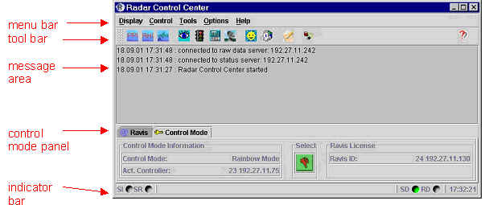

El contenedor de todo. En Ravis son cuatro zonas: menú + barra de iconos, tres paneles de
entrada y un área de mensajes grande en el centro. El nuestro tiene que resolver, además, que
existan ~60 destinos sin convertir la navegación en un árbol de tres niveles.

**Elementos:**

| Elemento | Contenido |
|---|---|
| Identificación de sitio | nombre del radar, IP/host, indicador `simulated` si el HAL es el simulador |
| Navegación | acceso a las 63 vistas, agrupadas por familia |
| Barra de estado global | autoridad de control, nivel de acceso, indicadores SI/SR/SD/RD (ver A6), reloj UTC + local |
| Resumen de alarma | semáforo BiTE agregado, clicable hacia B8 |
| Zona de trabajo | mosaico de 1 a 4 paneles, con barra de presets por tarea |
| Área de mensajes | últimos eventos (ver A5) |

**Estados:** conectado / desconectado / conectado-sin-datos (`stale`) / pasivo (sin autoridad) /
mantenimiento desbloqueado / simulado.

**Notas.** Ravis permitía "desenganchar" barras de herramientas y moverlas (§3.3). No replicar
eso. Lo que sí hay que resolver es el caso del ciclo `Mb` → `Pb` → `Ps` → `Mb` (F1–F3), donde el
técnico alterna entre un formulario de setup y un plot: es exactamente un preset de dos paneles.

**Componentes:** `AppShell`, `GlobalStatusBar`, `SiteIdentity`, `ClockPair`, `AlarmSummaryButton`,
`EnvironmentBadge`, `PanelMosaic`, `PanelFrame`, `PanelViewPicker`, `PresetBar`, `PresetManager`.

## A2 — Connection / Login

**P0 · OP · modal o vista de arranque.** Origen: RAVIS §6.1.

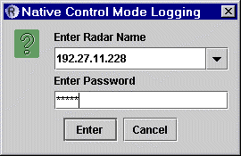

En Ravis es un combo con nombres de radar conocidos y campo libre para IP. En nuestro caso hay
**un solo radar**, así que esta vista se reduce a: selección de destino (RCP real vs simulador),
estado de la conexión y errores de conexión legibles.

**Controles:** destino (real / simulador), host/puerto si aplica, botón `Connect` / `Disconnect`,
reintento.

**Estados:** desconectado, conectando, conectado, rechazado, versión incompatible.

**Nota.** No hay usuarios ni contraseñas aquí (decisión tomada). La contraseña de mantenimiento
vive en A4, no en la conexión.

**Componentes:** `ConnectionForm`, `ConnectionStatusBadge` *(existe)*, `ErrorCallout`.

## A3 — Control Authority

**P0 · OP · siempre accesible desde la barra global.** Origen: RAVIS §6.2.

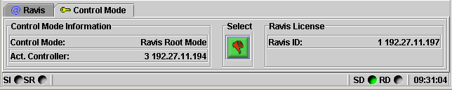

Ravis define cuatro niveles jerárquicos con contraseña por nivel:

| Modo | Nivel | Significado |
|---|---|---|
| All Access Mode | 1 | solo escucha, control desactivado |
| Ravis Operate Standby | 2 | cede control a otros centros |
| Ravis Operate | 3 | toma control si el nivel actual es menor |
| Ravis Root | 4 | toma control incluso sobre Ravis Operate |

Nuestro plan fija **operador único y red air-gapped**, así que la jerarquía de cuatro niveles no
aplica. Lo que sí aplica es el eje **pasivo / activo**: quién manda ahora mismo, y el hecho de
que al tomar control se descarta el scheduler en curso (Ravis lo advierte explícitamente).

**Controles:** conmutar pasivo/activo, identificación del actor, aviso de consecuencias al tomar
control.

**Estados:** pasivo, activo, en transición, denegado.

**Notas.** Ya existe `ControlAuthorityCard` en `mmi/`. El diseño debe decidir si esto es una
tarjeta, un control en la barra global, o ambos (resumen + detalle). **Todos los controles de
escritura de toda la aplicación dependen de este estado**: el diseño necesita un tratamiento
visual único para "esto existe pero no puedes tocarlo porque no tienes control", distinto de
"esto está deshabilitado porque no hay conexión".

**Componentes:** `ControlAuthorityCard` *(existe)*, `AuthorityToggle`, `ConfirmDangerDialog`.

## A4 — Maintenance Unlock

**P1 · MANT.** Origen: RAVIS §7.4 (*Maintenance Mode*, protegido por contraseña).

En Ravis, iniciar calibraciones exige Maintenance Mode **y además** modo de control activo. Ese
doble requisito se conserva: nivel de acceso y autoridad de control son ejes independientes.

**Controles:** desbloquear (contraseña), bloquear, temporizador de re-bloqueo automático.

**Estados:** bloqueado, desbloqueado, expirando, expirado.

**Notas.** El diseño debe mostrar el estado de mantenimiento de forma **persistente y evidente**
mientras esté activo — es un modo en el que se pueden romper cosas. Decidir si expira por
inactividad; recomendamos que sí.

**Componentes:** `AccessLevelGate`, `MaintenanceBanner`, `PasswordPrompt`.

## A5 — Event Log

**P0 · OP · concurrente con todo.** Origen: RAVIS §5.3.

Lista de eventos desde el arranque, el más reciente arriba, con fecha, hora y evento; FIFO con
tope de entradas. Es distinto de B8 (BiTE): aquí van las acciones del propio MMI y del RCP, allí
los mensajes de test del radar.

**Controles:** filtro por severidad, búsqueda, copiar, exportar, limpiar, autoscroll on/off.

**Estados:** vacío, con eventos, autoscroll pausado por el usuario.

**Componentes:** `EventLogPanel`, `EventRow`, `SeverityChip`, `LogToolbar`.

## A6 — Alarm / Indicator Bar

**P0 · OP · siempre visible.** Origen: RAVIS §6.3.

Ravis define cuatro indicadores de dos letras con semántica de color muy concreta:

| Indicador | Verde | Gris | Rojo |
|---|---|---|---|
| `SI` Scheduler Installed | tarea recibida, esperando inicio | sin scheduler | — |
| `SR` Scheduler Running | scan en ejecución | ninguno en curso | — |
| `SD` Status Data port | conexión activa con datos | conexión activa, **sin datos de estado en 5 s** | sin conexión |
| `RD` Raw Data port | conexión activa con datos crudos | conexión activa, **sin datos crudos en 5 s** | sin conexión |

Al pasar el ratón por encima aparece el detalle (por ejemplo, la tasa real de transferencia).

**Este es el origen del estado `stale` de todo el sistema** y merece un tratamiento de primera
clase en el diseño, no un punto gris de 6 px.

**Componentes:** `IndicatorBar`, `IndicatorLamp`, `DataRateTooltip`, `StaleBadge`.

## A7 — System Information

**P1 · OP.** Origen: RAVIS §13.

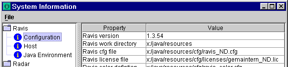

Árbol de dos niveles (root item / leaf item) con el valor del item seleccionado. Contenido
legacy:

| Root | Leaf | Contenido |
|---|---|---|
| Ravis | Configuration | versión, ficheros de configuración en uso |
| | Host | propiedades del sistema operativo |
| | Java Environment | versión, uso de memoria |
| Radar | Components | ID del radar, subsistemas, *alive* de cada uno |
| | Location | ubicación del radar |
| | Status Clients | clientes conectados |
| RCP | Process Info | procesos en ejecución |
| | Module Info | módulos de software instalados |
| ACU | Module Info | módulos instalados |
| LCU | Module Info | módulos instalados |
| RSP | Features | versión del software del RSP y features soportadas |

Traducción a nuestro sistema: versión del RCP, del MMI, del contrato DSP vendorizado (con su
ancla SHA-256), del HAL activo (real/simulador), del DSP, del ACU/LCU, y ubicación del radar.

**Controles:** exportar a fichero (Ravis lo pedía para soporte), copiar, buscar.

**Componentes:** `InfoTree`, `KeyValueTable`, `ExportButton`.

## A8 — About / Versions

**P2 · OP.** Origen: RAVIS §5.2 (*Help → About*). Versión, copyright, licencias. Vista mínima;
puede fusionarse con A7 si el diseño lo prefiere.

---

# Familia B — Estado y supervisión

## B1 — System Visualization (mímico)

**P0 · OP · candidata a estar siempre visible.** Origen: RAVIS §7.1.

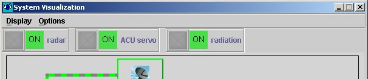

La vista más característica del legacy: un esquema del radar con **nueve elementos de
subsistema**, líneas animadas entre ellos, y tres comandos en la fila superior.

**Comandos (los únicos accionables de la vista):** `Radar on/off`, `Servo on/off`,
`Radiation on/off`. Todo lo demás es informativo.

**Subsistemas:** Rx, Tx, Antenna, DRX/Aspen, RCP, LCU, ACU, Remote, Periphery (deshidratador,
soplantes, etc.).

**Color del marco de cada subsistema** = agregado de todos sus estados internos: verde normal,
amarillo advertencia, rojo fallo, gris sin conexión.

**Líneas animadas:**

- Tx↔Antenna y Rx↔Antenna animadas = radiación encendida; grises = radiación apagada.
- RCP↔DRX, RCP↔LCU, RCP↔ACU, RCP↔Remote animadas = hay comunicación; grises = rota.
- Si LCU no está en operación: borde de LCU, Tx y Rx atenuado y línea LCU↔RCP en rojo.
- Ídem para ACU con ACU y Antenna.

**Color de `Remote`** = modo de control del sistema (en Ravis: verde All Access, morado Rainbow,
cian Ravis Operate, azul claro Ravis Root, blanco RCL Shell). En nuestro caso se reduce al par
pasivo/activo, pero la idea de "el mímico dice quién manda" se conserva.

**Menú de la ventana:** cerrar; `Sound` (indicación acústica de error on/off); `XY-Plot` (→ B4).

**Notas de diseño.** Es un diagrama, no una lista de tarjetas: la topología (qué está conectado
con qué, por dónde va la radiación) es información operativa real. Hay que decidir si es SVG
estático con estados, o un layout generado. **Y hay que resolver la alarma sonora**: existe en el
legacy y es una decisión de producto, no solo visual.

**Componentes:** `MimicDiagram`, `SubsystemNode`, `MimicLink`, `CommandLamp`, `SoundToggle`.

## B2 — Subsystem Detail

**P0 · OP · se abre desde B1 al pulsar un subsistema.** Origen: RAVIS §7.1.5.

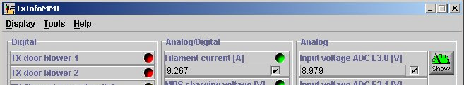

Lista de estados del subsistema en tres clases:

- **digitales** — on/off, ok/fallo.
- **analógico-digitales** — valor analógico con límites; la lámpara refleja si está dentro.
- **analógicos** — valor numérico puro (opcional).

Cada fila tiene descripción + lámpara de color (verde/amarillo/rojo/gris) con tooltip
explicativo. Si ACU o LCU no están operativos, las lámparas se pintan atenuadas para indicar
"este dato no es actual" — **otra forma de `stale`, distinta de la de A6**.

**Interacciones específicas del legacy que hay que decidir si conservamos:**

- Botón derecho sobre un estado → activar/desactivar su participación en el agregado del
  subsistema (volátil, se pierde al cerrar sesión). Es un *silenciador de alarma por señal*.
- Checkbox por fila + botón → abre B3 con esos valores como instrumentos analógicos.

**Componentes:** `StatusLampRow`, `StatusLampGrid`, `AnalogLimitRow`, `ValueReadout`,
`AggregateToggle`, `StaleOverlay`.

## B3 — Analog Instruments

**P2 · OP.** Origen: RAVIS §7.1.6.

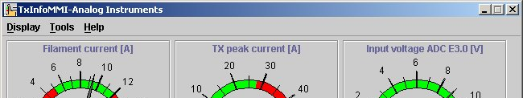

Ventana con los valores seleccionados en B2 dibujados como **instrumentos de aguja**, con los
límites marcados en rojo sobre la escala.

**Nota honesta al equipo de diseño:** los diales de aguja son una convención de 2003. Para
valores con límites, un *bullet chart* o una barra con banda de tolerancia es más legible y más
compacto. Se documenta la vista porque existe la necesidad (ver un analógico contra sus
límites), no porque haya que dibujar agujas. Decisión de diseño.

**Componentes:** `AnalogGauge` o `LimitBar`, `InstrumentGrid`.

## B4 — State Trend Plot (XY)

**P1 · OP.** Origen: RAVIS §7.1.4.

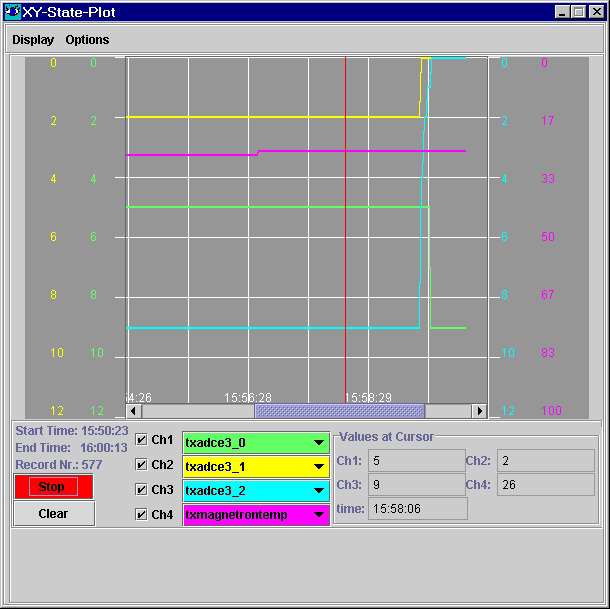

Traza en el tiempo varios estados analógicos a la vez. Comportamiento legacy, que es un buen
punto de partida:

- N canales, cada uno on/off, cada uno con selector de qué estado traza.
- Botones start / stop / continue / clear. Al continuar tras una pausa, **se dibuja un marcador
  con la marca de tiempo del evento de reanudación**.
- Cursor con botón derecho: muestra los valores en la posición del cursor abajo a la derecha.
- Resolución temporal fija de 1 s; duración máxima de una traza continua 8 h.
- Valores redondeados al entero más próximo.

**Componentes:** `TrendChart`, `ChannelSelector`, `PlotCursor`, `PlotTransportControls`,
`TimeMarker`.

## B5 — RCP Process Monitor

**P1 · MANT.** Origen: RAVIS §7.1.9. Tabla de procesos del RCP con su estado actual. El
equivalente RVP900 (`V`) lista procesos, PID, prioridad y política de planificación
(`RealTimeRR`), que es información de diagnóstico útil de verdad.

**Componentes:** `ProcessTable`, `StatusLamp`, `RefreshButton`.

## B6 — Remote Partners

**P2 · OP.** Origen: RAVIS §7.1.10 y §7.1.11. Iconos de cada aplicación conectada al radar, con
su IP/hostname, coloreados según el modo de control. Incluía mensajería punto a punto entre
operadores (§7.1.11) con área de mensajes coloreada: negro recibido, azul enviado, rojo nuevo
par conectado, rosa desconectado.

**Con operador único y red air-gapped esto pierde casi todo su sentido.** Se documenta por
completitud; recomendamos reducirlo a una lista de clientes conectados dentro de A7 y descartar
la mensajería. Si aun así se quiere, el diseño debe cubrir: lista de pares, selector de
destinatario, área de texto, historial coloreado por tipo de evento, y opción "no emerger".

**Componentes:** `ClientList`, (opcional) `MessagePanel`.

## B7 — Power Monitor (VSWR)

**P1 · OP.** Origen: RAVIS §7.7.

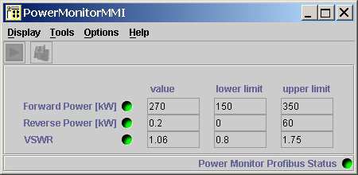

| Magnitud | Descripción |
|---|---|
| Forward Power [kW] | potencia de salida del transmisor hacia la antena |
| Reverse Power [kW] | potencia reflejada de vuelta al sistema de guía de onda |
| VSWR | relación de onda estacionaria calculada por la LCU a partir de las dos anteriores |

Cada magnitud se muestra con su **límite actual editable** y una lámpara que pasa de verde a
rojo al salirse. Al pie, el **estado del Profibus**: si la comunicación no está bien, las
lámparas de las tres magnitudes pasan a gris (no válidas) — otro caso de `stale` con causa
identificada.

**Acciones:** `Set` (envía límites, volátil, se pierden al resetear la LCU) y `Save` (persiste en
la LCU). **`Save` solo es posible con la radiación apagada**; si se pulsa con radiación
encendida, el sistema pide apagarla manualmente. Es un caso perfecto para el patrón de
"acción bloqueada por condición física" que hay que diseñar una sola vez.

**Componentes:** `MeasurementLimitRow`, `LimitEditor`, `SetSaveActions`, `BusStatusFooter`,
`BlockedActionExplainer`.

## B8 — BiTE Messages

**P0 · OP · candidata a estar siempre visible.** Origen: RAVIS §9.

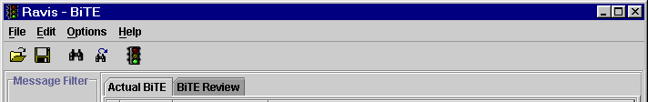

Frontend del Built-in Test Equipment. Estructura legacy: barra de menú, barra de herramientas,
área de filtro con niveles, área de mensajes y área de mensaje extendido.

**Columnas del mensaje:** nivel (color), radar de origen (vacío = mensaje interno del MMI),
fecha de generación, titular. Ordenable por cualquier columna. Al pulsar un mensaje, su
descripción larga aparece en el área extendida (en Ravis el formato era HTML).

**Niveles:** verde información, amarillo advertencia, rojo error. Por defecto **solo se muestran
advertencias y errores**; al activar el nivel verde también aparecen los ya recibidos — es decir,
**el filtro filtra la vista, no la captura**. Importante para el diseño: nada se pierde por tener
un filtro puesto.

**Acciones:** cargar lista guardada (abre la pestaña *BiTE Review*, → B9), guardar lista actual
(guarda todo, ignorando el filtro), buscar patrón / siguiente, limpiar tabla, **confirmar error**
(resetea el semáforo a verde), auto-limpiar al conectar con otro radar.

**Semáforo:** icono de tres luces que refleja la peor condición recibida; **una advertencia no
sobreescribe un error anterior**; se resetea pulsándolo. Está sincronizado con el icono del
Control Center.

**Componentes:** `BiteMessageTable`, `SeverityFilterBar`, `SeverityChip`, `MessageDetailPanel`,
`TrafficLight`, `FindBar`, `FaultBadgeRow` *(existe)*.

## B9 — BiTE Review

**P1 · OP.** Origen: RAVIS §9.2.1/§9.3.1. Misma tabla que B8 pero sobre un informe guardado, en
pestaña separada de la lista viva. El diseño debe dejar clarísimo cuándo se mira historia y
cuándo tiempo real — confundirlos en un radar es grave.

**Componentes:** reutiliza los de B8 + `HistoricalModeBanner`, `FilePicker`.

## B10 — System Status

**P0 · OP.** Origen: agregado de RAVIS §7.1 y del comando `V`/`Vz` del RVP900 (§4.1.2).

Vista de una sola pantalla con el estado de salud completo: subsistemas agregados, uptime,
temperaturas, tensiones, contadores de trigger, estado del AFC, modo de receptor, diagnósticos de
arranque. Del `V` del RVP900 salen campos que hoy no tienen equivalente en Ravis y que conviene
exponer:

| Campo | Ejemplo |
|---|---|
| Versión de software del DSP | `V13.1(Pol)` |
| Versión con la que se guardaron los ajustes | `V12.3` |
| Arranque y hora actual (⇒ uptime) | `13:07:33 3 JUN 2012` |
| Diagnósticos de arranque | `PASS` o máscara de error |
| Procesos y prioridades | `RVP9Proc-0 PID:6917 Priority:10 RealTimeRR` |
| Sincronización GPS | `GPS:In use` |
| AFC | nivel %, estado, potencia y frecuencia del burst |
| Temperaturas | chasis y FPGA, en °C |
| Modo de receptor | `0 (Standard single channel)` |
| Uso de TrigRAM y contador de triggers | `4.8% de 588 KBytes, TrigCount:8777651` |

`Vz` es lo mismo pero **poniendo los contadores a cero**: hace falta un control explícito de
"reiniciar contadores" con su confirmación.

**Componentes:** `StatusGrid`, `MetricTile`, `TemperatureReadout`, `UptimeDisplay` *(existe)*,
`CounterResetAction`, `DiagnosticsBadge`.

---

# Familia C — Control de antena y adquisición

## C1 — Antenna Control

**P0 · OP · concurrente con D2/D3/D4 y con H1 (alineación solar).** Origen: RAVIS §7.2.

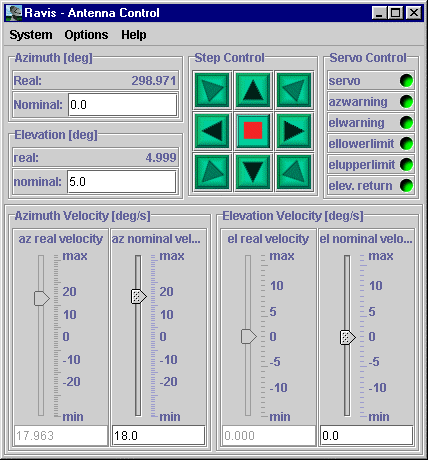

Cuatro bloques:

1. **Lectura real** — azimut, elevación, velocidad de azimut, velocidad de elevación ("real
   values").
2. **Consigna** — azimut y elevación nominales por teclado.
3. **Velocidad** — deslizador + campo numérico por eje.
4. **Step control** — teclado tipo joystick que mueve la antena en pasos.

Más una sección de **Servo Control** de solo lectura:

| Señal | Significado |
|---|---|
| `servo` | servo encendido/apagado |
| `azwarning` | estado del amplificador del motor de azimut |
| `elwarning` | estado del amplificador del motor de elevación |
| `ellowerlimit` | interlock de elevación inferior |
| `elupperlimit` | interlock de elevación superior |
| `elev.return` | retorno automático de elevación activo: en modo velocidad, la antena invierte el sentido al exceder límites |

Si hay valores o iconos en gris: no hay control o no hay dato.

**Notas de diseño.** El jog es un control con consecuencias mecánicas: necesita respuesta
inmediata, estado de "en movimiento", y una parada evidente. En `mmi/` ya existen
`AntennaPositionReadout`, `AxisSelector` y `AxisPositioningFields`; el panel de jog está
deliberadamente fuera de `JobActionPanel` (lo dice un comentario en el código) y sigue
pendiente de diseño.

**Componentes:** `AntennaPositionReadout` *(existe)*, `AxisPositioningFields` *(existe)*,
`AxisSelector` *(existe)*, `JogPad`, `VelocitySlider`, `ServoStatusPanel`, `LimitIndicator`,
`EmergencyStopButton`.

## C2 — Step Control Setup

**P1 · OP · modal desde C1.** Origen: RAVIS §7.2.1.

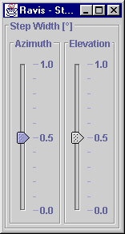

Ancho de paso del jog, definible por el usuario entre **0.1° y 1.0°**, independiente para azimut
y elevación. El manual explica para qué sirve de verdad: seguir la posición del sol durante la
alineación de la antena (→ H2, donde se pide explícitamente 0.1° en ambos ejes).

**Componentes:** `StepWidthSetup`, `NumberField`.

## C3 — Scan Worksheet

**P0 · OP.** Origen: RAVIS §7.3. Es la vista más densa del legacy.

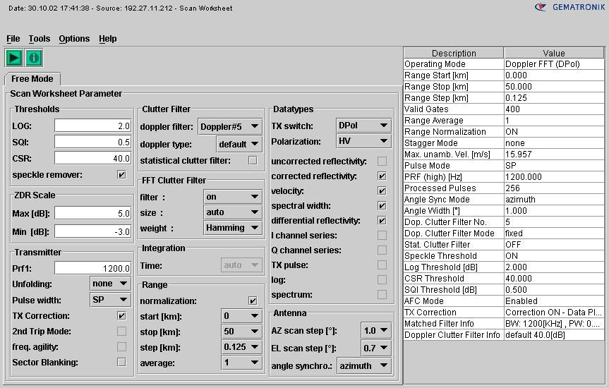

Modo libre ("Free Mode"), pensado para mantenimiento: define todos los parámetros de adquisición
del procesador de señal. **El layout es dinámico**: depende de qué soporta el radar conectado
(ZDR, filtro estadístico, segundo trip, agilidad de frecuencia…). Y hay **verificación cruzada
entre parámetros**: algunas combinaciones no son seleccionables. El diseño necesita un patrón
para "esta opción está deshabilitada *por culpa de* esa otra", con la causa visible.

**Inventario completo de parámetros:**

| Grupo | Parámetro | Tipo / rango | Notas |
|---|---|---|---|
| Thresholds | LOG Threshold | dB, típico 1–3 | offset de reflectividad restado a la señal |
| | SQI Threshold | 0–1, típico 0.3–0.5 | coherencia; por debajo, velocidad y ancho espectral pasan a "no data" |
| | CSR Threshold | dB | relación clutter/señal; por encima, la intensidad pasa a "no data" |
| | Speckle remover | on/off | elimina estimaciones aisladas en rango |
| ZDR Scaling | min / max | rango 8–32 dB | solo dual-pol continua; en dual-pol conmutada es fijo −8…+24 dB |
| Transmisor y modo | Prf | Hz | PRF alta en modo dual-PRF; se fija según el ancho de pulso |
| | Unfolding | none / 2:3 / 3:4 / 4:5 | staggering de PRF |
| | Pulse width | LP / SP / (MP) | verificado contra la PRF pedida |
| | TX Correction | on/off | corrección de amplitud y fase; la de fase es necesaria para velocidad en magnetrón |
| | 2nd Trip Mode | on/off | **incompatible con unfolding** |
| | freq. agility | on/off | **con ella no hay velocidad ni ancho espectral** |
| | Sector Blanking | on/off | los sectores se definen en C5; apagarlo puede radiar sobre zonas pobladas |
| Clutter filter | Doppler Filter | none, 1–15 | anchos de 0.1 a 4.5 m/s a 5700 MHz / 1200 Hz; escalan con frecuencia y PRF |
| | Doppler Type | default / 30 / 40 / 50 dB | profundidad del filtro |
| | FFT based Filter | on/off | alternativa IIR/FFT |
| | FFT pulses/CPI | 32 / 64 / 128 / 256 / auto | *auto* ajusta al par velocidad de antena / resolución angular |
| | FFT window | rectangular / hamming | |
| | statistical clutter filter | on/off | se aplica a la reflectividad **no corregida** |
| Integration | Integration Time | nº de pulsos | solo válido sin sincronización angular |
| Range | Range Normalisation | on/off | corrección por inverso del cuadrado |
| | range start / stop | km | |
| | range step | m, ≥62.5 | tamaño final de la celda |
| | range average | entero | puntos promediados por celda; `range step / range average ≥ 62.5 m` |
| Polarización | modo conmutado | H / V / HV / HHV | HV y HHV: solo UZ y ZDR (HV) o UZ, V, W, ZDR (HHV); **sin filtro de clutter y con TX-Correction obligatoria** |
| | modo continuo | Spol / Dpol V-pol / Dpol H-V | sin limitaciones de tipo de dato ni de filtro |
| Data types | UZ, CZ, V, W, ZDR | selección múltiple | disponibilidad según modo |
| | I / Q channel series | crudos, solo DRX | |
| | TX pulse | envolvente del pulso transmitido, solo DRX | usado en G2 |
| | log | serie de potencia logarítmica | |
| | spectrum | opción | espectro de una celda seleccionada (→ D5) |
| Antena | AZ scan step | grados | ventana de integración en azimut |
| | EL scan step | grados | ventana de integración en elevación |
| | angle synchronization | azimuth / elevation / none | |

**Barra de herramientas:** `Send Scan Parameter` (activa los ajustes) e `Info` (abre una sección
que compara lo pedido en el worksheet con lo realmente procesado — es decir, **nominal vs actual
dentro de la misma vista**; el detalle vive en E-*/DRX Process Monitor).

**Ayuda contextual:** en el legacy, botón derecho sobre algunos campos (por ejemplo los
umbrales) da información adicional. Con 40 parámetros de significado no obvio, la ayuda
contextual no es un adorno: es parte del diseño.

**Componentes:** `ParameterGroupCard`, `ParameterField`, `ThresholdField`, `FilterSelector`,
`PulseWidthSelector`, `RangeLayoutEditor`, `DataTypeSelector`, `PolarizationModeSelector`,
`CrossCheckExplainer`, `NominalVsActualTable`, `SendParametersBar`, `FieldHelpPopover`.

## C4 — Control Routine Runner

**P0 · OP.** Origen: **propio del RCP**, no del legacy — el plan de proyecto define seis rutinas
de control (encendido general, encendido de transmisor, encendido de receptor analógico,
encendido de la unidad de antena, movimiento de antena, posicionamiento de antena). Ver
`operacion/rutinas-control.md`.

Cada rutina es una secuencia con precondiciones, orden enviada y confirmaciones. El resultado
puede ser **completada, fallida o interrumpida** (la rutina 1 documenta explícitamente el caso
"el radar sí quedó encendido pero falló un chequeo final") — tres resultados, no dos.

**Elementos:** lista de precondiciones con su estado en vivo, botón de ejecución (deshabilitado
con la causa visible si alguna precondición falla), progreso paso a paso, resultado con detalle,
cancelación.

**Componentes:** `JobActionPanel` *(existe)*, `PrecheckList`, `RoutineStepper`,
`ResultSummaryCard`, `BlockedActionExplainer`.

## C5 — Sector Blanking Editor

**P1 · MANT.** Origen: RAVIS §7.4.3 y RVP §4.2.4.

Ravis: **cuatro secciones de elevación con cuatro sectores de azimut cada una**, en orden
ascendente, con dos restricciones: `min. az. sector diff` (diferencia mínima permitida entre dos
sectores de azimut) y `max. az. sector size` (tamaño máximo de un sector).

RVP900 (`Mt`): **ocho sectores**, cada uno con `InUse`, rango AZ (desde, hasta) y rango EL
(desde, hasta), más la opción global `Blank output triggers within AZ and EL sectors`.

Es seguridad radiológica: apagar un sector mal definido significa radiar sobre una zona poblada.
**El diseño debe incluir una representación gráfica del sector sobre un círculo de azimut**, no
solo ocho filas de números.

**Componentes:** `SectorBlankingEditor`, `AzimuthSectorDial`, `SectorRow`, `ValidationSummary`,
`SetSaveActions`.

## C6 — Scan Schedule Indicator

**P2 · OP.** Origen: RAVIS §6.3 (indicadores `SI`/`SR`). En Ravis el scheduler vivía en Rainbow,
no en el MMI; Ravis solo mostraba si había uno instalado y si estaba corriendo, y advertía de que
**tomar control activo descarta el scheduler**. Si el RCP acaba teniendo scheduler propio, esta
vista crece; por ahora se documenta como el par de indicadores de A6 más el aviso al tomar
control.

---

# Familia D — Vistas de datos

Decisión tomada: **el MMI dibuja las vistas de datos** como herramienta de diagnóstico, aunque el
producto meteorológico final sea del ORPG. Eso implica render de alto rendimiento (canvas o
WebGL), no SVG por celda.

## D1 — Data View Container

**P0 · OP.** Origen: RAVIS §8.2.

El legacy envuelve cada vista de datos en un **contenedor** con menú común y ventanas auxiliares
(gestión de color, parámetros de scan). Se permite ejecutar varios contenedores en paralelo, y el
número máximo de PPI/RHI/ASCOPE simultáneos dependía de la licencia.

**Menú común:** `Load` (solo demostración), `Screen Shot`, `Help`.

**Con el paradigma ya decidido** (shell fijo + mosaico de 1–4 paneles), el "contenedor" del
legacy se disuelve: el panel del mosaico **es** el contenedor. Lo que hay que conservar de §8.2 es
que las ventanas auxiliares (paleta, parámetros de scan, overlay) acompañan a su vista de datos y
no viven sueltas; en el mosaico eso significa panel lateral o *popover* dentro del propio panel,
no un quinto panel.

Sigue en pie que **varias vistas de datos pueden coexistir** —dos PPI con tipos de dato distintos,
o PPI + ASCOPE— y que **cada una se congela por separado**. Con cuatro paneles como máximo, hay
que decidir qué ocurre al pedir una quinta vista: reemplazar el panel activo es lo más simple y
lo que recomendamos.

**Componentes:** `PanelFrame`, `ViewToolbar`, `AuxPanelSlot`.
*(`DataViewContainer` y `PanelHost` desaparecen: los absorbe `PanelMosaic` de A1.)*

## D2 — ASCOPE

**P0 · OP.** Origen: RAVIS §8.3.

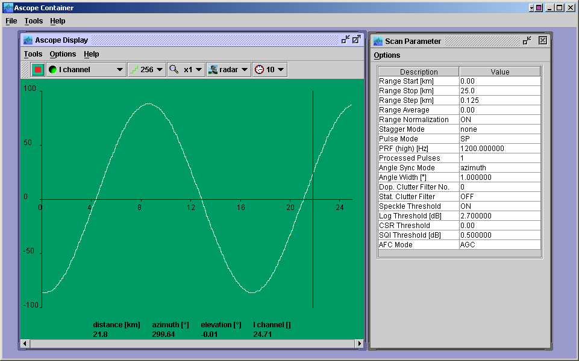

Osciloscopio: intensidad de cada celda de rango contra el rango. Al pulsar un punto con el botón
izquierdo se fija un cursor que muestra **distancia, azimut, elevación e intensidad** en las
unidades del tipo de dato elegido, y esos valores **se actualizan con cada nuevo conjunto de
datos** mientras el cursor siga puesto.

**Barra de herramientas:**

| Control | Valores |
|---|---|
| freeze / unfreeze | congela esta vista sin afectar a las demás; el icono alterna conectado/desconectado |
| selección de tipo de dato | pestañas; verde = disponible ahora, gris = no disponible con los ajustes actuales; **se adapta sola al cambiar el Scan Worksheet** |
| resolución | 16…256 niveles (256 = 8 bit por celda); más resolución = más ancho de banda |
| zoom | pantalla completa o factor; con zoom aparece un deslizador para recorrer el rango |
| fuente de datos | radar o fichero; las fuentes disponibles se distinguen por color |
| refresh rate | 1…N; a 10 solo se pinta 1 de cada 10 conjuntos — imprescindible con antena rápida |

**Menú:** unidad del eje X (`km` / `µsec`), modo de display (`Maximum` o `Average` por píxel
cuando varias celdas caen en el mismo píxel), espectro (→ D5), parámetros de scan (→ D8),
screenshot, print.

**Componentes:** `ScopePlot`, `DataTypeTabs`, `ResolutionSelector`, `ZoomControl`,
`DataSourceSelector`, `RefreshRateSelector`, `FreezeToggle`, `CursorReadout`, `AxisUnitToggle`,
`PixelAggregationToggle`.

## D3 — PPI

**P0 · OP.** Origen: RAVIS §8.4.

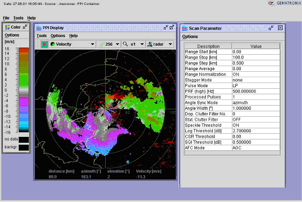

Presentación 2D de intensidad contra azimut y rango, con proyección del rango inclinado sobre la
superficie terrestre. **Una línea radial blanca indica la posición actual de la antena** y gira
según la velocidad de azimut. Cursor con los mismos cuatro valores que el ASCOPE.

Misma barra de herramientas que D2 (freeze, tipo de dato, resolución, zoom, fuente), sin
`refresh rate`.

**Opción "Location out of Center" (§8.4.3):** con factor de zoom > 1 aparece **una vista general
sin zoom encastrada dentro del contenedor**, con un rectángulo blanco que marca la región
ampliada; pulsando dentro de esa vista general se redefine el centro de la vista ampliada. Es un
patrón de *overview + detail* que hay que diseñar bien.

**Componentes:** `PpiPlot`, `AntennaSweepLine`, `OverviewInset`, `ColorScaleLegend`,
`CursorReadout`, `RangeRings`, + los de la barra de D2.

## D4 — RHI

**P0 · OP.** Origen: RAVIS §8.5. Igual que D3 pero altura contra rango; el radar está en la
esquina inferior izquierda y la línea radial sigue la velocidad de elevación. El cursor añade
**altura** a los cuatro valores.

**Componentes:** `RhiPlot` + los de D3.

## D5 — Range-bin Spectrum

**P2 · MANT.** Origen: RAVIS §8.3.1.2.3 y tipo de dato `spectrum` del Scan Worksheet. Espectro
Doppler de una celda de rango seleccionada. Herramienta de diagnóstico de filtro de clutter;
emparienta directamente con F2 (`Ps`).

**Componentes:** `SpectrumPlot`, `BinSelector`.

## D6 — Color Management y Color Composer

**P1 · OP.** Origen: RAVIS §8.6.

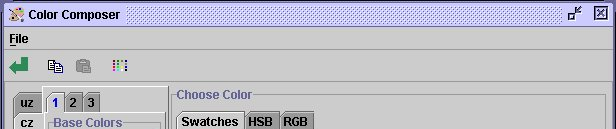

Dos piezas:

**Color Management** — la tabla de color en uso, mostrada dentro del contenedor de la vista;
opción `stay on top` para que no la tapen otras ventanas.

**Color Composer** — editor completo: una **matriz de presets** (varios presets por tipo de
dato, en pestañas), un selector de color con tres modos (`Swatches`, `HSB`, `RGB`), y una barra
de herramientas con: aplicar a la vista, copiar preset completo, pegar preset, **interpolar**
entre dos o más colores seleccionados (interpolación lineal en RGB). Menú: guardar preset,
restaurar preset, fijar como predeterminado, salir — **con confirmación**, porque en el legacy
era demasiado fácil destruir una tabla por accidente.

Además existen colores reservados para "sin dato" y para el fondo.

**Nota de diseño importante:** las paletas de radar no son decorativas, son el instrumento de
medida. Interpolación lineal en RGB produce bandas perceptualmente desiguales. Vale la pena que
el diseño proponga paletas perceptualmente uniformes por defecto (y que se mantenga el editor
para quien necesite reproducir una paleta institucional concreta).

**Componentes:** `ColorScaleLegend`, `ColorTableEditor`, `ColorSwatchGrid`, `ColorChooser`,
`PresetMatrix`, `InterpolateAction`, `ConfirmDangerDialog`.

## D7 — Overlay Manager

**P2 · OP.** Origen: RAVIS §8.4.4. Capas geográficas sobre el PPI, cada una con visibilidad y
color propios:

`BORDER` (fronteras políticas / costa), `ROAD`, `POP_PLACE` (poblaciones), `HEIGHT`
(hipsografía), `RANGE` (círculos de rango), `LATLONGRID` (rejilla de lat/long).

Botonera con la semántica clásica: `OK` (aplica y cierra), `Apply` (aplica sin cerrar), `Save`
(persiste para próximas sesiones), `Cancel` (descarta).

**Componentes:** `OverlayLayerList`, `LayerColorPicker`, `DialogActionBar`.

## D8 — Scan Parameter Popup

**P1 · OP.** Origen: RAVIS §8.3.1.1.1 y equivalentes en PPI/RHI. Ventana de solo lectura con los
parámetros de scan vigentes para los datos que se están viendo. Es el "¿con qué ajustes se tomó
esto?" — imprescindible cuando se compara con una medida anterior.

**Componentes:** `KeyValueTable`, `Popover` o panel lateral.

---

# Familia E — Configuración del DSP

Decisión tomada: **todo lo visual cae en el RCP; el DSP es una caja negra y el usuario solo
trabaja contra el RCP.** Por tanto los menús TTY del RVP900 (`Mc`, `Mp`, `Mf`, `Mt`, `Mt<n>`,
`Mb`, `Mz`, `M+`) y sus vistas de lectura (`V`, `Vz`, `Vp`) se convierten en pantallas gráficas
del MMI. Los nombres de parámetro que siguen son los del RVP900 porque documentan *qué hace
falta configurar en un DSP de radar meteorológico*; nuestro DSP es propio y el contrato real lo
fija `interfaces/dsp.md`. **El equipo de diseño debe tratar esta lista como el volumen y la
naturaleza de los campos, no como el contrato final.**

Patrones comunes a toda la familia E, heredados del comportamiento del TTY y que hay que
resolver una sola vez:

- **Tres juegos de valores:** *current* (con los que opera ahora), *saved* (no volátil, se
  restauran al arrancar) y *factory*. Los comandos `S` (guardar), `R` (restaurar) y `F` (fábrica)
  operan entre ellos. El flujo recomendado por el manual es `R` → editar → `S`, porque el menú
  siempre parte de los valores *current*, que el host puede haber cambiado por debajo.
- **Los cambios no surten efecto hasta salir** del modo de configuración (`Q`). Es decir: hay una
  noción de *edición pendiente de aplicar* que la UI debe hacer explícita.
- **Cada parámetro tiene límites** y el TTY los imprime al rechazar un valor. Nuestra validación
  debe mostrar el rango *antes* de que el usuario se equivoque.
- **Tras actualizar el software, un parámetro nuevo toma el valor de fábrica y se imprime un
  aviso.** Eso merece una notificación visible, no una línea de log.

## E1 — DSP Setup Hub

**P1 · MANT.** Origen: RVP §4.1 (lista de comandos del menú).

Punto de entrada a E2–E12: qué grupos hay, cuál está modificado respecto a *saved*, acceso a los
perfiles (E11) y a los plots de ajuste (F1–F4), y el aviso global de "hay cambios sin aplicar".
El comando `??` del legacy imprime **todos** los ajustes de una vez para copia impresa: el
equivalente moderno es exportar la configuración completa.

**Componentes:** `SetupHubGrid`, `DirtyBadge`, `ExportConfigButton`, `ProfileActionsBar`.

## E2 — Processing Options (`Mp`)

**P1 · MANT.** Origen: RVP §4.2.2. El grupo más grande.

| Bloque | Parámetros |
|---|---|
| Espectros | `Spectral Window` (User/Rect/Hamming/Blackman), `Allow continuous sizes for power spectra` |
| Algoritmos | `R2 Processing` (Never/User/Always), `Clutter Microsuppression` (ídem), `PPP autocorrels from DFTs` (ídem), `Unfold Velocity (Vh−Vl)` (ídem), `Process w/ custom trigs` (ídem) |
| Series temporales | `Use High-SNR 16-bit packed timeseries format`, `Minimum freerunning ray holdoff` (% del dwell) |
| Linealización | `Linearized saturation headroom` (dB) |
| Corrección por Tx | `Apply amplitude correction based on Burst/COHO`, `Time constant of mean amplitude estimator` (pulsos) |
| Canales | `Channel separation` (dB, grados), `Maximum deviation` (dB, grados), `Overlap/Interpolate interval` (dB) |
| Filtro de interferencia | `Interference Filter` (None/Alg.1/Alg.2/Alg.3), `Threshold parameter C1` (dB), `Threshold parameter C2` (dB) |
| Modos heredados | `Provide WSR88D legacy BATCH major mode` |
| Desplegado de velocidad | `Maximum range to unfold` (km), `Low-PRF bins range averaged on each side`, `Overlay power` (Refl/Vel/Width en dB) |
| Polarimetría | `T/Z/V/W computed from: H-Xmt / V-Xmt`, `T/Z/V/W computed from: Co-Rcv / Cx-Rcv`, `Polarimetric Power Params – NoiseCorrected`, `Polarimetric Correlations – NoiseCorrected`, `PhiDP – Negate / Offset` (grados), `Polarimetric Attenuation Correction` |
| KDP | `LSQ Length` (km), `LSQ Weights (FIR) Width` (km), `Standard Smoothing Factor`, `Adaptive Smoothing Factor` |
| Dual Rx | `DualRx – Sum H+V Time Series` |
| Clasificación | `Melting height` (metros) |
| Corrección de Z0 | `Enable noise power based correction of Z0`, `Baseline` (dB/dB por encima de cierto Clutter/Noise), `HiSignal` (dB/dB) |

**Nota de diseño:** el patrón `0:Never, 1:User, 2:Always` aparece cinco veces. Es un control
ternario con semántica "el host decide / forzar sí / forzar no" y merece un componente propio,
no tres radios sueltos.

**Componentes:** `ParameterGroupCard`, `TernaryOverrideField`, `NumberField`, `ToggleField`,
`PairedNumberField` (dB + grados), `FieldHelpPopover`.

## E3 — Thresholds Matrix (`Vp`)

**P1 · MANT.** Origen: RVP §4.1.3.

Matriz de **19 parámetros de dato** (`DBZ`, `DBT`, `VEL`, `WID`, `ZDR`, `KDP`, `PHIDP`, `RHOHV`,
`SQI`, `LDRH`, `RHOH`, `PHIH`, `LDRV`, `RHOV`, `PHIV`, `HCLASS`, `SNR`, `DBZA`, `DBTA`) × **5
umbrales** (`LOG` en dB, `CSR` en dB, `WSP` en dB, `SQI`, `PMI`) **+ una columna de banderas**
`TCF` que se muestra en forma numérica y simbólica a la vez:

```
DBZ:  0.75dB  -18.0dB  5.0 dB  0.149  0.449  0x8888 ( LOG & CSR )
WID:  0.75dB  -18.0dB  5.0 dB  0.398  0.449  0xA000 ( LOG & SQI & SIG )
SQI:  0.75dB  -18.0dB  5.0 dB  0.398  0.449  0xFFFF ( All Pass )
```

En el RVP900 esta vista es **solo lectura** desde el TTY (se edita vía comando de host).
**Decisión tomada (2026-09-19): en nuestro MMI también es solo lectura, de momento.** La matriz se
muestra, no se edita; los valores llegan del DSP.

Aun siendo de solo lectura, la columna `TCF` **no puede mostrarse como `0x8888`**: hay que
renderizar la expresión booleana legible (`LOG & CSR`, `LOG & SQI & SIG`, `All Pass`) con el hex
como dato secundario. Eso es un componente de presentación, no un editor.

Si más adelante se abre la edición hará falta `FlagExpressionEditor` (editor de la expresión
booleana), que por ahora queda fuera de alcance.

**Componentes:** `ThresholdMatrix`, `ThresholdCell`, `FlagExpressionDisplay`, `HexFlagBadge`.
*(Diferido: `FlagExpressionEditor`.)*

## E4 — Clutter Filters (`Mf`)

**P1 · MANT.** Origen: RVP §4.2.3.

Siete filtros, cada uno con su tipo y sus parámetros, que cambian según el tipo:

| Filtro | Tipo | Parámetros |
|---|---|---|
| #1 | `0 (Fixed)` | `Win`, `WidthPts`, `EdgePts` |
| #2 | `0 (Fixed)` | ídem |
| #3 | `0 (Fixed)` | ídem |
| #4 | `1 (Variable)` | `Win`, `WidthPts`, `EdgePts`, **`HuntPts`** |
| #5 | `3 (Gaussian Model)` | `Win`, **`Spectrum width`** (m/s) |
| #6 | `3 (Gaussian Model)` | ídem |
| #7 | `3 (Gaussian Model)` | ídem |

**El conjunto de campos depende del tipo elegido** — formulario condicional, patrón que hay que
diseñar bien porque se repite en E6 (forma de onda Tx) y E7 (servo de AFC).

Parámetros relacionados del mismo entorno: `Secondary SQI Threshold Slope/Offset`,
`Max power mismatch across octants` (dB), `High power rejection threshold` (dB),
`Maximum KEY phase error` (grados).

Y del lado Ravis (§7.3.2.4) el catálogo operativo equivalente: 15 anchos de filtro Doppler IIR
con profundidades de 30/40/50 dB, filtros FFT alternativos con 32/64/128/256 pulsos por CPI o
selección automática y ventana de Hamming opcional, y filtro estadístico.

**Componentes:** `FilterTypeSelector`, `ConditionalFieldGroup`, `FilterList`, `FilterPreview`
(la respuesta del filtro se ve de verdad en F2).

## E5 — Trigger Setup general (`Mt`)

**P1 · MANT.** Origen: RVP §4.2.4.

| Parámetro | Tipo |
|---|---|
| `Pulse Repetition Frequency` | Hz (límites 50–20000) |
| `Transmit pulse width` | índice de ancho de pulso |
| `Use external pretrigger` | sí/no |
| `PreTrigger active on rising edge` | sí/no |
| `PreTrigger is synchronous with IFD AQ clock` | sí/no |
| `PreTrigger fires the transmitter directly` | sí/no |
| `Number of user-defined output triggers` | entero |
| `Number of polarization output controls` | entero |
| `Blank output triggers within AZ and EL sectors` | sí/no + 8 sectores (→ C5) |
| `Blank output triggers during noise measurement` | sí/no |
| `Rx-Fixed Triggers` | 6 triggers + `P0`, `P1`, cada uno sí/no |
| `2-way (Tx+Rx) total waveguide length` | metros |

**Componentes:** `ParameterGroupCard`, `ToggleGrid`, `SectorBlankingEditor` (compartido con C5).

## E6 — Trigger Setup por pulse width (`Mt<n>`)

**P1 · MANT.** Origen: RVP §4.2.5. **Se repite entero por cada ancho de pulso** — el diseño
necesita un selector de ancho de pulso persistente y una forma clara de comparar/copiar entre
anchos.

**Tabla de triggers** (6 filas):

| Columna | Formato |
|---|---|
| `Start` | µsec, opcionalmente `+ (k * PRT)` — **el campo admite un término proporcional al periodo** |
| `Width` | µsec |
| `High` | sí/no (polaridad) |

Límites: inicio −5000…+5000 µsec, ancho 0…5000 µsec.

**Resto de parámetros del grupo:**

| Parámetro | Unidad |
|---|---|
| `Maximum number of Pulses/Sec` | /s |
| `Maximum instantaneous 'PRF'` | /s |
| `External pretrigger delay to range zero` | µsec |
| `Range mask spacing` | metros |
| `Tx Intermediate Frequency` / `Rx Intermediate Frequency` | MHz |
| `FIR-Filter impulse response length` | µsec |
| `Burst Freq Estimator – Length / Start` | µsec |
| `FIR-Filter prototype passband width` | MHz |
| `Output control 4-bit pattern` | 0–15, se teclea en decimal |
| `Current noise level` / `Powerup noise level` | dBm (en dual: `PriRx` y `SecRx` por separado) |
| `Transmitter phase switch point` | µsec |
| `Polarization switch point for POLAR1 / POLAR2` | µsec |
| `Tx Waveform` | `0:CWPulse`, `1:LinFM`, `2:NLFM` |
| `Bandwidth of transmit pulse` | MHz |
| `Pulselength of transmit pulse` | µsec |
| `Zero offset of transmit pulse` | µsec |
| `TxWave MIN / MAX / actual tuning params` | 3 valores adimensionales cada uno |

Los tres parámetros de *tuning* se ajustan en vivo desde F4 (`Pa`), con mínimos y máximos que
acotan el rango: es un caso claro de **el mismo dato editable desde dos vistas**, y hay que
decidir cuál manda.

**Componentes:** `PulseWidthSelector`, `TriggerTimingTable`, `PrtTermField`, `WaveformTypeSelector`,
`BoundedTuningField`, `CopyBetweenProfilesAction`.

## E7 — Burst Pulse & AFC (`Mb`)

**P1 · MANT.** Origen: RVP §4.2.6. Emparejado con F2 (`Ps`), que es donde se ve si esto está bien.

| Bloque | Parámetros |
|---|---|
| Frecuencias | `Tx Intermediate Frequency` (MHz), `Rx Intermediate Frequency` (MHz), `IF increases for an approaching target` |
| Burst | `PhaseLock to the burst pulse`, `Minimum power for valid burst pulse` (dBm), `Design/Analysis Window` (Rect/Hamming/Blackman), `Settling time (to 1%) of burst frequency estimator` (s) |
| AFC | `Enable AFC and MFC functions`, `AFC Servo` (`0:DC Coupled` / `1:Motor/Integrator`), `Wait time before applying AFC` (s), `AFC hysteresis Inner / Outer` (kHz), `AFC outer tolerance during data processing` (kHz), `AFC feedback slope`, `AFC minimum / maximum slew rate` |
| AFC eléctrico | `AFC format` (`0:Bin`, `1:BCD`, `2:8B4D`) + `ActLow`, `AFC uplink protocol` (`0:Off`, `1:Normal`, `2:PinMap`), **tabla de 25 pines** (`Pin01`…`Pin25` → bit), `FAULT status pin` + `ActLow`, `Burst frequency increases with increasing AFC voltage` |
| Seguimiento | `Enable Burst Pulse Tracking`, `Enable Time/Freq hunt for missing burst`, `Number of frequency intervals to search`, `Settling time for each frequency hop` (s), `Automatically hunt immediately after being reset`, `Repeat auto hunt every` (s) |
| Calibración | `Enable burst power based correction of Z0` |
| Simulación | `Simulate burst pulse samples`, `Frequency span of simulated burst` (MHz a MHz) |

**Con servo `Motor/Integrator` cambian tres campos**: la pendiente pasa a `D-Units / kHz` y los
slew mínimo y máximo pasan de velocidad (`D-Units/sec`) a petición (`D-Units`). Formulario
condicional otra vez.

**La tabla de 25 pines** es una matriz pin→bit editable. Es fea en TTY y puede ser buena en
gráfico; conviene diseñarla junto con F5 (modo de test de AFC), que es donde se verifica.

**Componentes:** `ParameterGroupCard`, `ServoModeSelector`, `ConditionalFieldGroup`,
`PinMapEditor`, `HysteresisField` (inner/outer como un par), `RangeField` (span MHz–MHz).

## E8 — Transmissions & Modulations (`Mz`)

**P2 · MANT.** Origen: RVP §4.2.8.

| Bloque | Parámetros |
|---|---|
| Modulación de fase | `Provide phase modulation of transmitted pulses`, `Number of binary angle phase bits to use`, `Phase angle to apply when idle` (grados + hex), `Modulation` (`0:None`, `1:Random`, `2:Custom`, `3:SZ(8/64)`) |
| Canal A | `Chan A` (`0:Unused`, `1:FixedFreq`, `2:TxWaveform`), `FreeRunning fixed frequency` (MHz), `Output CW power level` (dBm), `Apply pulse-to-pulse phase modulation`, `Fixed relative phase offset` (grados) |
| Canal B | `Chan B` (mismas opciones), `Output power level` (dBm) + `Peak` sí/no, `Apply pulse-to-pulse phase modulation` |
| Chirp | `FM Chirp manual spectrum flattener` (%/MHz) |

**Nota de proyecto:** el klystron excitador de nuestro radar admite fase programable pulso a
pulso, así que la opción `SZ(8/64)` es viable a nivel de hardware y no debe descartarse del
diseño como "no aplicable".

**Componentes:** `ChannelConfigCard` (×2), `ModulationSelector`, `PhaseAngleField` (grados ↔ hex).

## E9 — Top-Level Configuration (`Mc`)

**P2 · MANT.** Origen: RVP §4.2.1. Configuración de infraestructura, no de radar:

| Parámetro | Notas |
|---|---|
| `IP address of networked RVP9/IFD` | enlace dedicado, sin routers/switches en medio |
| `Maximum ethernet incoming UDP frame length` | 250–8192 bytes; jumbo frames |
| `Receive buffer size for incoming UDP packets` | 100 000–5 000 000 bytes |
| `IFD synthesized system clock` | 50–100 MHz, resolución 0.1 Hz |
| `IFD clock is derived from an external reference` + `External input reference` | sí/no + MHz |
| `Live angle input` | `0:None`, `1:SimRVP`, `2:SimIFD`, `3:TAGs`, `4:S/D`, `5:RtCtrl` |
| `TAG bits to invert` AZ/EL | máscaras de 16 bits en hex |
| `TAG scale factors` AZ/EL | factor con signo |
| `TAG offsets` AZ/EL | grados |
| `Co-Polarized signal is always on the primary Rx` | sí/no |
| `Default receiver mode` | 0 single, 2 legacy WDN, 3 dual channel |

**El modo de receptor no surte efecto hasta guardar y reiniciar el procesador** — un tipo de
cambio distinto de todos los demás, y la UI tiene que decirlo en el momento de cambiarlo.

Los campos de TAG son máscaras de bits en hexadecimal: si se conservan, merecen un editor de
bits, no un campo de texto hex.

**Componentes:** `NetworkConfigCard`, `ClockSourceSelector`, `AngleInputSelector`,
`BitMaskEditor`, `RestartRequiredNotice`.

## E10 — Debug Options (`M+`)

**P2 · MANT.** Origen: RVP §4.2.7. `Noise level for simulated data` (dB) y
`Nyquist sign flip of plotted IF samples` (sí/no). Vista pequeña, pero **debe verse claramente
que el sistema está en un modo de depuración** si algo aquí está activo.

**Componentes:** `DebugFlagsCard`, `ActiveDebugBanner`.

## E11 — Config Profiles

**P1 · MANT.** Origen: RVP §4.1.1.

Gestión de los tres juegos de valores: ver diferencias entre *current* y *saved*, guardar,
restaurar, cargar valores de fábrica, exportar/importar, y el registro de qué versión de software
guardó los ajustes por última vez (el RVP900 lo usa para hacer una "actualización inteligente"
cuando aparece un parámetro nuevo).

**El diff entre configuraciones es la pieza central de esta vista**, y no existe en el legacy: el
TTY solo permite listar. Es una mejora obvia y barata.

**Componentes:** `ProfileActionsBar`, `ConfigDiffView`, `ConfirmDangerDialog`, `ImportExportMenu`.

## E12 — DSP Internal Status (`V` / `Vz`)

**P1 · MANT.** Origen: RVP §4.1.2. Versión de mantenimiento de B10, con el detalle completo:
procesos y políticas de planificación, fechas de compilación de las bibliotecas, uso de TrigRAM,
contadores de trigger, temperaturas de chasis y FPGA, estado de GPS, AFC (nivel, potencia y
frecuencia del burst), modo de receptor y resultado de diagnósticos.

También es el sitio natural para los campos de `GPARM` (RVP §7.9), que es lo que el host lee del
DSP: número de celdas, periodo de trigger actual, TAGs, nivel de ruido medido, estado latcheado
del procesador, cuatro *immediate status words*, dos registros de diagnóstico, pulsos por rayo,
contador de triggers, celdas adquiridas y procesadas correctamente, periodos mínimos por ancho de
pulso, PRT al inicio y al final del último rayo, umbrales en uso, ruido I²/Q², desviación
estándar del ruido LOG, relación de ruido H/V, valor de control AFC/MFC, selección y constantes
del filtro de interferencia, slew de seguimiento del burst y espaciado de la máscara de rango.

**Componentes:** `StatusGrid`, `ProcessTable`, `CounterResetAction`, `RawStatusWordsPanel`
(con decodificación simbólica de los bits, no solo el hexadecimal).

---

# Familia F — Ajuste asistido por gráfico

Los comandos `P*` del RVP900 son un osciloscopio virtual: un plot en vivo, una lista de
subcomandos de una tecla, y **dos líneas de información** — la primera cambia solo al ejecutar un
subcomando, la segunda se reescribe sobre sí misma varias veces por segundo como línea de estado
viva. Ese patrón —*plot en vivo + parámetros estáticos + línea de estado viva + controles de
ajuste fino/grueso*— es **un solo componente reutilizado cuatro veces**, y así conviene
diseñarlo.

Convenciones comunes a F1–F4, todas con equivalente gráfico obligatorio:

- **Minúscula = paso fino, mayúscula = paso grueso.** Se traduce a controles de *nudge* con dos
  tamaños de paso, y a atajos de teclado que conserven la convención.
- **`.` = Single Step.** Congela el plot y la línea de estado; cada pulsación avanza una
  actualización. Cualquier otra tecla vuelve a vivo.
- **`Q` / `ESC` = salir**, `?` = reimprimir la lista de subcomandos. La ayuda de atajos tiene que
  estar visible o a una tecla.
- **Los ajustes de presentación (zoom, span, promediado) se guardan en NVRAM** y se restauran al
  volver a entrar en el plot. Es decir: el estado de la vista es persistente, no de sesión.
- **`>` / `<` inician y paran el volcado de lo que se está pintando a un fichero de log**, una
  línea por plot. Equivalente moderno: grabar la serie a CSV.
- **`%` alterna entre las cinco entradas IF** del módulo (conectores SMA). Selector de fuente.
- Los plots reportan `No Trigger` cuando se espera un trigger externo y no llega.

## F1 — Burst Pulse Timing (`Pb`)

**P1 · MANT.** Origen: RVP §5.3.

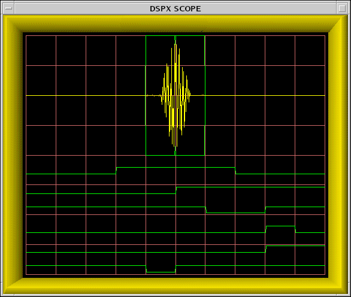

Ajusta el temporizado de los triggers y la ventana de muestreo A/D para que el pulso de
transmisión quede bien capturado. Eje horizontal = tiempo; el span total se llama `PlotSpan`.

| Control | Acción |
|---|---|
| `I/i` | longitud de la respuesta impulsional del filtro adaptado, ±1 tap |
| `A/a`, `S/s` | apertura e inicio de la subventana de muestras para AFC (aparecen **dos ventanas** dibujadas cuando la de AFC es más corta que la del FIR) |
| `L/l`, `R/r` | desplaza **todos los triggers a la vez** a izquierda/derecha; fino 0.025 µs, grueso 1.000 µs |
| `T/t` | span del plot: 2, 5, 10, 20, 50, 100, 200, 500, 1000, 2000, 5000 µs |
| `Z/z` | zoom de amplitud, potencias de 2 hasta ×128 |
| `B/b` | desactiva/reactiva el seguimiento de burst (**hay que desactivarlo para poder mover los triggers**) |
| `+` | busca el burst perdido, probando valores sucesivos de AFC |

**Línea de estado viva:** `Zoom`, `PlotSpan`, `FIR` (µs y nº de taps), canal IF, `Freq` (MHz),
`Pwr` (dBm), `DC` (% de offset del A/D, debe estar dentro de ±2.0 %), `Trig#1` (µs; si el
transmisor lo dispara un pretrigger externo, se muestra `PreDly` en su lugar) y `BPT` (slew de
seguimiento en µs).

**Dependencia visible:** `b` desactiva el tracking **y pone el slew a cero**; `B` lo reactiva
partiendo de cero. Una acción con efecto lateral que la UI tiene que explicar.

**Nivel de señal recomendado:** pico entre −3 dBm y +4 dBm; máximo absoluto +8 dBm. Se puede
dibujar como bandas objetivo en el propio plot en vez de dejarlo en el manual.

## F2 — Burst Spectra & Matched Filter (`Ps`)

**P1 · MANT.** Origen: RVP §5.4. La vista más rica de esta familia.

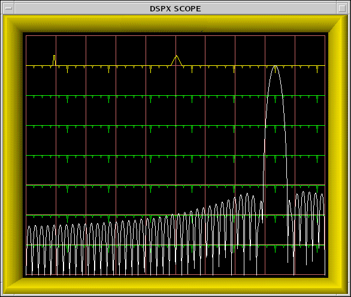
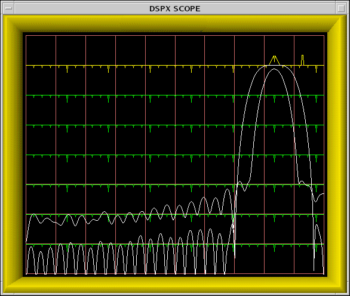
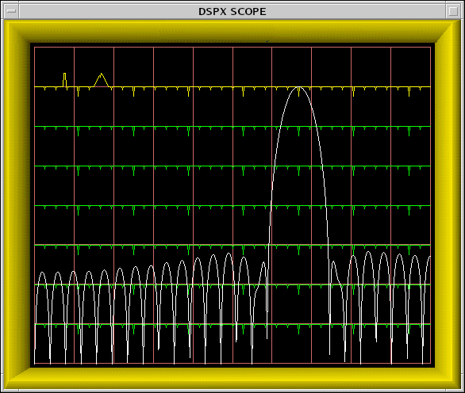

Analiza el contenido espectral del burst, diseña el filtro paso banda adaptado, dibuja su
respuesta en frecuencia y ayuda a alinear el AFC. Eje vertical logarítmico con líneas tenues cada
10 dB y un rango dinámico de 70 dB.

| Control | Acción |
|---|---|
| `I/i` | longitud de la respuesta impulsional, ±1 tap |
| `N/n`, `W/w` | ancho de banda del filtro: fino 1 kHz, grueso 100 kHz |
| `U/u`, `D/d` | **MFC**: fija la salida AFC a mano; fino 0.05 D-Units, grueso 1.0 |
| `=` | activa/desactiva MFC (al salir con MFC activo, avisa y da una segunda oportunidad de volver a AFC) |
| barra vertical | entra en el submodo de test de AFC (→ F5) |
| `A/a`, `S/s` | apertura e inicio de la ventana de AFC |
| `#` | imprime los coeficientes del filtro actual, normalizados a ±1 |
| `$` | **busca automáticamente un filtro óptimo** (ganancia DC cero) alrededor del actual: pregunta los spans de longitud y ancho, muestra progreso, se puede abortar con `Q`; en modo dual receptor busca el mejor compromiso entre las dos IF |
| `V/v` | número de espectros promediados (1–25) |
| `Z/z` | zoom de amplitud |
| espacio | alterna entre plots |
| `%` | alterna entre receptores |

**Línea de estado viva:** `Navg`, `FIR` (µs y taps), `BW` (ancho de −3 dB del filtro; el centro
está fijo en la IF), `DCGain` (número negativo en dB o la palabra `ZERO` si hay cero exacto en
DC), `Freq`, `Pwr`, `Loss` (pérdida del filtro en dB; **solo aparece si la potencia del burst
supera el umbral de burst válido**) y `AFC` con nivel en % (−100…+100) **y su estado**:

| Estado | Significado |
|---|---|
| `(Disabled)` | ni AFC ni MFC; la salida queda fija en 0 % |
| `(Manual)` | MFC anula al AFC; `U`/`D` mueven la tensión |
| `(NoBurst)` | energía del burst por debajo del mínimo; el lazo está parado |
| `(Wait)` | el burst acaba de hacerse válido; se espera a que el transmisor se estabilice |
| `(Track)` | siguiendo para meter la frecuencia dentro de la histéresis interior |
| `(Locked)` | dentro de la histéresis exterior tras haber estado dentro de la interior — **este es el estado en el que se debe adquirir** |

Además, cuando el AFC usa un formato digital especial, se imprime **el patrón de bits codificado**
junto al valor: binario en base 10, BCD en hex, `8B4D` con los 16 bits bajos en hex y el resto en
base 10.

**Notas de diseño.** Esos seis estados de AFC son una máquina de estados con una transición
deseable (`Locked`) y varias de alerta. Merecen un indicador propio, con historia reciente —
saber que el lazo entra y sale de `Locked` es precisamente lo que se quiere detectar. El
buscador `$` es una operación larga con progreso y cancelación: patrón de tarea en segundo plano.

## F3 — Receiver Waveforms (`Pr`)

**P1 · MANT.** Origen: RVP §5.5.

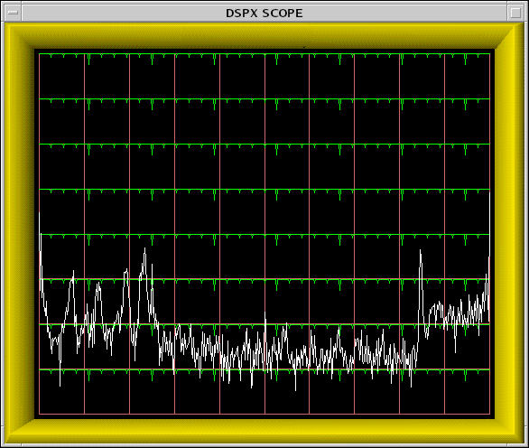

Verifica que se detectan blancos con buena sensibilidad.

| Control | Acción |
|---|---|
| `L/l`, `R/r` | inicio de la ventana de muestras IF; fino 0.25 µs, grueso 10 µs; **no puede ser anterior al rango cero** |
| `T/t` | duración de la ventana; **no puede ser menor que la respuesta impulsional del FIR**, máximo 50 µs |
| `V/v` | espectros promediados, 1–25 |
| `Z/z` | zoom ×1…×128; **los plots LOG se desplazan en incrementos de 6 dB** al hacer zoom |
| espacio | alterna entre tres contenidos: muestras recibidas / muestras + potencia LOG / espectro de potencia recibida |

**Línea de estado viva:** `Zoom`, `Navg`, `Start` (µs **y** km), `Span` (µs), canal IF,
`Total` (dBm), `Filtered` (dBm, solo lo que cae dentro del paso banda del FIR) y `MidSamp`
(dBm, usando solo las muestras del centro exacto). La diferencia `Total − Filtered` **es** la
pérdida del filtro para esa forma de pulso: vale la pena calcularla y mostrarla, en vez de dejar
que el técnico la reste de cabeza.

## F4 — Tx Waveform Ambiguity (`Pa`)

**P2 · MANT.** Origen: RVP §5.6. Solo aplica con pulso comprimido.

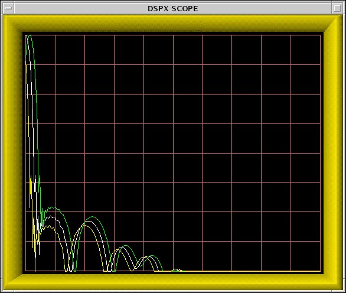

| Control | Acción |
|---|---|
| `S/s`, `L/l` | longitud del pulso; fino 0.05 µs, grueso 1 µs |
| `N/n`, `W/w` | ancho de banda; fino 10 kHz, grueso 200 kHz |
| `1` / `2` / `3` | elige cuál de los tres parámetros de *tuning* se va a cambiar |
| `D/d`, `U/u` | baja/sube el parámetro elegido; fino 0.001, grueso 0.05; **imprime los tres valores en cada pulsación** |
| `V/v` | desplazamiento Doppler simulado, hasta 100 kHz; dibuja +V y −V como trazas verde y amarilla junto a la blanca de Doppler cero |
| `Z/z` | zoom; el rango dinámico del plot de lóbulos laterales es de 80 dB |
| `$` | busca la forma de onda óptima |

**Línea de estado viva:** `BW` (MHz), `PW` (µs), `PSL` (nivel de pico de lóbulo lateral, dB
relativo al lóbulo principal), `ISL` (nivel integrado de lóbulos laterales, dB), `TxLoss` (dB) y
`RxLoss` (dB).

**Nota:** `TxLoss` entra en el cálculo de la constante del radar (→ G7). Es otro dato que cruza
entre familias y que conviene enlazar en la UI.

## F5 — AFC Test / Pin Map

**P2 · MANT.** Origen: RVP §5.4.2, submodo dentro de `Ps`.

Verificación eléctrica de la interfaz AFC digital de 25 bits:

- `W` — patrón *walking ones*: desplaza un único `1` por la palabra, con transición cada ~4 ms.
  Sirve para trazar el cableado con un osciloscopio.
- Teclas `0`–`9` y `A`–`O` — conmutan bits individuales para componer cualquier patrón de 25 bits.
- `P` — alterna entre numeración **por pin** (útil para probar el cableado uno a uno) y **por
  bit** (útil una vez verificado el cableado y creada la tabla de mapeo de `Mb`).
- Mientras tanto, `Ps` sigue corriendo y la información habitual del AFC se sustituye por la
  lectura hexadecimal del valor de 25 bits, etiquetada `(Bits)` o `(Pins)`.

**Es una pantalla de instrumentación electrónica**: 25 conmutadores de bit, un indicador de
patrón, y un modo de patrón automático. Diseñarla como una rejilla de bits, no como un campo hex.

**Componentes:** `BitPatternTester`, `BitToggleGrid`, `PinBitModeSwitch`, `WalkingOnesControl`.

## F6 — Display Test Pattern (`P+`)

**P2 · MANT.** Origen: RVP §5.1.

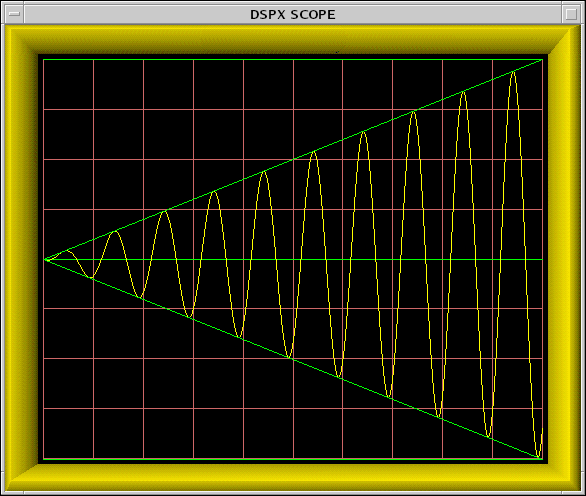

Seis trazos superpuestos (tres líneas horizontales, dos diagonales y una senoide cuya fase
avanza en cada refresco) para comprobar que el subsistema de dibujo funciona. En el legacy tenía
sentido con hardware de display dedicado; en web es una comprobación de render y de latencia de
refresco, que sigue siendo útil para diagnosticar "el plot está congelado" vs "no llegan datos".

---

# Familia G — Calibración y alineación de receptor/transmisor

En Ravis todo esto vive en una sola ventana (`RSP (DRX) Control`) con **seis pestañas**, más un
capítulo entero de procedimientos (§14). Aquí se separa en vistas porque el volumen lo pide, pero
el diseño puede volver a agruparlas si encuentra una organización mejor.

**Requisitos previos que el legacy impone a todas estas acciones:** modo de mantenimiento activo
(contraseña) **y** autoridad de control activa. Además, para calibrar, ACU y LCU deben estar en
estado *Remote*. El diseño necesita mostrar estas precondiciones **antes** de que el usuario
pulse, no como error después.

## G1 — Calibration Hub

**P1 · MANT.** Origen: RAVIS §7.4.

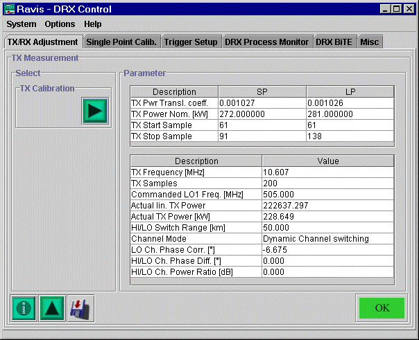

Punto de entrada a G2–G8, con: estado de las precondiciones, resultado y fecha de la última
calibración de cada tipo, y las acciones globales del menú legacy — `Calibration Log Window`
(→ G8), `Reboot RSP`, `Restore Default Values` (recupera los valores de calibración anteriores;
"los valores por defecto son siempre los últimos usados").

**Componentes:** `CalibrationHubGrid`, `LastRunCard`, `PrecheckList`, `DangerActionRow`.

## G2 — TX Sampling Adjust

**P1 · MANT.** Origen: RAVIS §7.4.1 y §14.2.1.

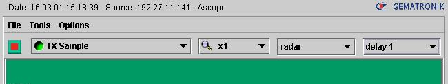

Procedimiento con **tres vistas abiertas a la vez** (el mejor argumento del documento a favor de
un espacio multipanel): Scan Worksheet pide el tipo de dato `TX pulse`; el ASCOPE lo muestra; y
esta pestaña fija el temporizado. El técnico lee la posición del bin en el ASCOPE, la multiplica
por 10 y teclea el resultado aquí, en unidades de 29 ns.

**Parámetros:**

| Campo | Significado |
|---|---|
| `TX Start Sample` | contador de inicio de detección del pulso TX, dependiente del ancho de pulso, en unidades de 29 ns |
| `TX Stop Sample` | ídem para el fin |
| `TX Sample` | número de pulsos TX muestreados por el DRX para detectar potencia y fase |
| `TX Frequency` | frecuencia intermedia real determinada por el DRX |
| `Commanded LO Freq.` | primer oscilador local nominal (MHz); solo magnetrón |
| `HI/LO Switch Range` | rango donde conmutan los canales IF de alta y baja sensibilidad |
| `Channel Mode` | `Static` (baja hasta el rango de conmutación, alta después) o `Dynamic` (decide por saturación hasta ese rango, alta después) |
| `Lo Ch. Phase Corr.` | corrección nominal de diferencia de fase entre canales, obtenida en la calibración de punto único |
| `HI/LO Ch. Phase Diff.` | diferencia de fase medida |
| `Hi/Lo Ch. Power Ratio` | atenuación entre canales |

**Acciones:** `Request new BiTE` (el DRX **solo reporta nuevos valores bajo petición**: esta
pantalla no se autoactualiza y eso hay que decirlo en la interfaz), `Set` (aplica sin guardar) y
`Save`. La aceptación de un parámetro **se indica cambiando su color a verde** — un patrón de
confirmación por campo que merece la pena conservar.

**Componentes:** `ParameterField` con estado de aceptación, `SetSaveActions`, `ManualRefreshBar`,
`ChannelModeSelector`, `CrossViewHint`.

## G3 — TX Power Calibration

**P1 · MANT.** Origen: RAVIS §7.4.1 y §14.2.2.

Lanza un script en el procesador del radar. Es un **procedimiento guiado con intervención humana
obligatoria**: el operador mide antes la potencia con un medidor externo a 500 Hz para cada ancho
de pulso, y el script le pide teclear esos valores en kW.

**Parámetros:** `TX Pwr Transl. coeff.` (coeficiente que traduce unidades lineales arbitrarias
del DRX a kW), `TX Power Nom.` (potencia nominal de referencia para la corrección en línea),
`Actual lin. Power`, `Actual TX Power` (kW).

**Precondición operativa que el manual subraya:** la radiación debe llevar **al menos 20 minutos**
encendida antes de empezar. Eso es un temporizador visible, no una nota al pie.

**Estados:** no ejecutada / en curso (con el paso actual) / esperando entrada del operador /
terminada con éxito / `ERROR` (el campo de resultado se pone rojo).

**Componentes:** `WizardStepper`, `OperatorPromptDialog`, `PerPulseWidthInputTable`,
`ProcedureResultBanner`, `WarmupTimer`.

## G4 — Single Point Calibration

**P1 · MANT.** Origen: RAVIS §7.4.2 y §14.3.

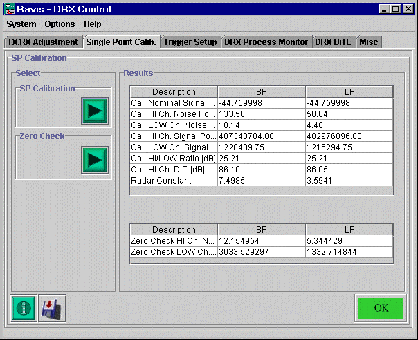

Inyecta una señal de potencia conocida y fija la relación entre esa señal y el nivel de potencia
del DRX; de ahí sale la constante del radar. Dos escenarios: con generador de test interno
(automático, sin interacción) o con generador externo (el script pide inyectar señal a cierto
nivel y luego retirarla).

**Parámetros mostrados:**

| Campo | Significado |
|---|---|
| `Cal. Nominal Signal Power` | potencia de inyección (dBm) |
| `Cal. HI/LOW Ch. Noise Power` | ruido lineal por canal, en unidades arbitrarias |
| `Cal. HI/LOW Ch. Signal Power` | potencia con señal inyectada, por canal |
| `Cal. HI/LOW Ratio` | atenuación calculada entre canales |
| `Cal HI Ch. Difference` | potencia del canal alto recalculada a dB |
| `Radar Constant` | resultado automático del procedimiento |
| `Zero Check HI/LOW Channel Noise` | ruido por canal resultante del Zero Check |

Lo que el procedimiento hace al sistema mientras corre (y que hay que mostrar, porque explica por
qué el radar "se comporta raro" durante unos minutos): sin movimiento en azimut y antena a 80° de
elevación, radiación apagada, AFC congelado a la frecuencia nominal, rango 20–200 km con celdas
de 250 m, 200 pulsos muestreados, DRX en detección de potencia lineal.

**Nota crítica:** los resultados **son volátiles hasta que se guardan**; si no se pulsa guardar,
se pierden al reiniciar. El legacy insiste en ello con avisos. Nuestro diseño debe hacer que ese
estado "resultado obtenido pero no guardado" sea imposible de pasar por alto.

**Componentes:** `WizardStepper`, `CalibrationResultTable`, `UnsavedResultBanner`,
`SystemStateDuringProcedure`, `OperatorPromptDialog`.

## G5 — Zero Check

**P1 · MANT.** Origen: RAVIS §7.4.2. Muestreo de ruido del receptor, cuyo resultado se resta a
los datos antes del procesamiento de momentos. **Se ejecuta automáticamente al arrancar el RCP y
luego a intervalos fijos**, además de poder lanzarse a mano — o sea, la vista es tanto de
seguimiento como de acción.

**Componentes:** `JobActionPanel` *(existe)*, `NoiseLevelReadout`, `ScheduleInfoRow`.

## G6 — RX Linearity Validation

**P2 · MANT.** Origen: RAVIS §7.6. Herramienta de puesta en marcha; el manual dice que es
"principalmente para el personal de mantenimiento de Gematronik al poner un sistema en servicio
por primera vez". Depende de un proceso `validate` en el RCP y de un generador de señal de test
calibrado, preferiblemente externo.

**Tres pestañas:**

1. **Result Table** — resultados en tabla; permite lanzar una medida nueva con el generador
   interno (un diálogo pide el ancho de pulso) y pedir al RCP el último resultado.
   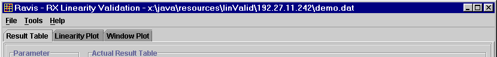
2. **Linearity Plot** — resultados por ancho de pulso, con tres opciones de display:
   `Noise corrected` (resta el ruido), `Channel Correction` (corrige el canal bajo con la
   diferencia entre canales) y `Channel Combination` (fusiona alto y bajo en un solo plot). Panel
   de selección con `Actual` (último punto pulsado), `Start`, `Stop`, `Interval` y `slope`
   (pendiente de la regresión lineal entre inicio y fin). Panel de info con `SP Point` (punto
   usado en la calibración de punto único, que es también el punto de conmutación) y `Ch. Diff.`.
   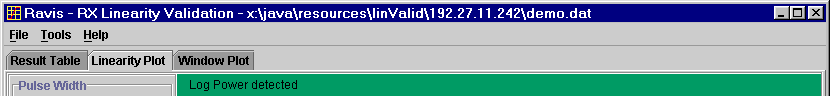
3. **Window Plot** — diferencia entre la parte lineal (por regresión) y las medidas; solo válida
   con las tres opciones anteriores activas. Parámetro `window` (diferencia permitida) e
   información de `start plot`, `stop plot`, `interval` y `actual`.
   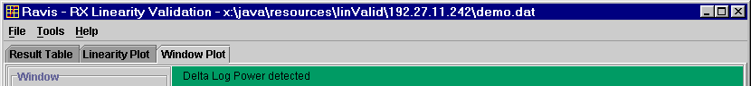

**Guardar y cargar medidas** para comparar campañas: es una vista con **noción de histórico**, no
solo de instante.

**Componentes:** `LinearityPlot`, `RegressionWindowPlot`, `MeasurementTable`, `PlotOptionToggles`,
`PointSelectionPanel`, `MeasurementFilePicker`.

## G7 — Radar Constant Parameters

**P1 · MANT.** Origen: RAVIS §7.4.6 (pestaña *Misc*).

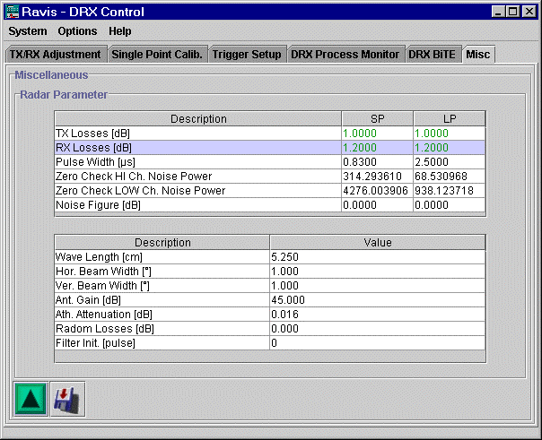

Parámetros del sistema que entran en la ecuación del radar. Casi todos estáticos y editables;
solo los de Zero Check se actualizan solos.

| Grupo | Parámetros |
|---|---|
| Dependientes del ancho de pulso | `Pulse Width` (anchos nominales), `Zero Check High/Low Channel Noise Power` |
| Pérdidas | `TX Losses` (dB, del acoplador bidireccional a la bocina), `RX Losses` (dB, de la bocina al front-end de bajo ruido), `Radom Losses` (dB), `Atmospheric` (dB/km) |
| Antena | `Horizontal beam width` (°), `Vertical beam width` (°), `Antenna Gain` (dB) |
| Sistema | `Wavelength` (cm), `Noise Figure` (opcional, solo con fuente de ruido), `Filter Init Pulses` (pulsos descartados para estabilizar el filtro Doppler en modo dual-PRF) |

**Dos acciones distintas:** una recalcula la constante del radar y la aplica sin guardar; la otra
calcula, aplica **y** guarda como predeterminada. La ecuación completa está en §14.3.4 del
manual; mostrarla junto a los campos, con los términos que el usuario está editando resaltados,
convertiría una pantalla de 15 cajas en algo comprensible.

**Componentes:** `ParameterGroupCard`, `EquationPanel`, `SetSaveActions`, `DerivedValueReadout`.

## G8 — Calibration Log

**P1 · MANT.** Origen: RAVIS §7.4 (*Options → Calibration Log Window*). Registro de cada
actividad individual del procedimiento en curso; es donde se revisa **por qué** falló una
calibración cuando el indicador se pone en `ERROR`. Debe poder quedar abierto junto al
procedimiento que lo genera.

**Componentes:** `LogStream`, `LogToolbar`, `SeverityChip`.

---

# Familia H — Alineación con el sol

## H1 — Sun Position

**P2 · OP.** Origen: RAVIS §10.2.

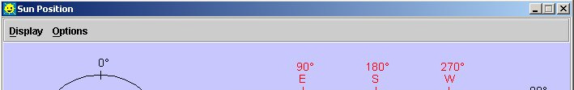

Calcula la posición del sol para un lugar y un instante. Al conectar con el radar, los parámetros
de ubicación se sustituyen por los del sistema conectado.

**Tres zonas:**

1. **Panel izquierdo** — visualización del azimut del sol (0° norte, 90° este, 180° sur, 270°
   oeste), con azimut y elevación en texto.
2. **Panel derecho** — azimut y elevación combinados, con **la trayectoria del sol durante el
   día**. El dibujo del sol solo aparece con elevación > −5°, y pasa de amarillo a gris por
   debajo de 0°.
3. **Panel de información** — fecha, hora local, **hora UTC (no editable)**, latitud y longitud.
   Fecha, hora, latitud (−90…+90) y longitud (−180…+180) son editables para consultar cualquier
   lugar e instante. El cálculo de años bisiestos es correcto hasta 2100.

**Sin receptor GPS, la hora sale del sistema**, así que hora local y zona horaria hay que
verificarlas para que el UTC sea correcto. Nuestro proyecto ya tiene decidida la separación entre
reloj de pared y reloj monótono; esta vista es de reloj de pared, y el diseño debe mostrar la
fuente de hora, no solo la hora.

**Componentes:** `SunPathPlot`, `SunAzimuthCompass`, `DateTimeLocationForm`, `ClockSourceBadge`.

## H2 — Sun Track Alignment

**P2 · MANT.** Origen: RAVIS §10.3.

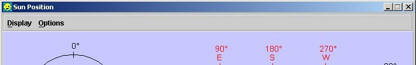

Extiende H1 para calcular y aplicar los desplazamientos de azimut y elevación de la antena.

**Cuatro partes:** botón de cálculo (activo al conectar), botón de envío (activo solo con
autoridad de control), área de cálculo de offset de azimut y área de offset de elevación; cada
una con posición nominal del sol, posición real detectada y offset calculado.

**Interacción clave, y la más difícil de rediseñar:** los campos no se teclean. Los valores se
capturan **desde el PPI, el RHI o el ASCOPE, pulsando con el botón derecho en el punto donde se
ve el reflejo del sol**; se abre una ventana para guardar azimut y/o elevación en la utilidad, y
en ese mismo instante se toma la posición del sol correspondiente. Es un flujo de captura entre
vistas que hoy resolveríamos mejor con un modo explícito de "capturar punto".

**El procedimiento completo** (§10.3.2), que el diseño debe poder acompañar:

1. Tomar control activo y abrir el control de sistema para apagar la radiación (se puede seguir
   al sol con radiación encendida, pero con elevación baja el reflejo queda tapado por otros ecos).
2. Abrir Sun Position y **verificar hora y ubicación**.
3. En el Scan Worksheet: `LOG threshold` a 0.0 y `TX correction` a `OFF`; enviar.
4. Según el caso:
   - **Corrección de azimut** (rutina normal de arranque): igualar la elevación de la antena a la
     del sol y poner velocidad de azimut ≈ 5 °/s; en el PPI, reflectividad no corregida, capturar
     el punto del reflejo.
   - **Corrección de elevación**: igualar el azimut, velocidad de elevación ≈ 5 °/s, sincronización
     angular a elevación, capturar en el RHI.
   - **Ajuste fino de ambos**: paso de jog a 0.1° en los dos ejes, sincronización angular a
     `none`, tiempo de integración ≈ 128, y ajustar con el jog hasta maximizar la reflectividad
     **en el ASCOPE**, capturando entonces ambos valores.
5. Calcular (los offsets anteriores se tienen en cuenta) y enviar a la ACU.
6. El sistema pregunta si guardar en memoria de la ACU: `YES` persiste tras un ciclo de
   alimentación (**tarda, y se aborta a los 40 s si falla**), `NO` es volátil. Cada caso termina
   con su propio mensaje de confirmación.

**Esto es un asistente de varios pasos que cruza cinco vistas.** Es el candidato más claro del
documento a convertirse en un flujo guiado en vez de en una colección de ventanas.

**Componentes:** `OffsetCalcPanel`, `CapturePointMode`, `WizardStepper`, `AcuPersistDialog`,
`LongOperationProgress`.

---

# Familia I — Utilidades y servicio

## I1 — Command Console (RCL)

**P2 · MANT.** Origen: RAVIS §12.

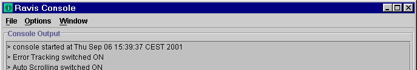

Línea de comandos contra el sistema, con salida de consola arriba y entrada abajo. **Emerge sola
ante un error grave.** Tres modos con escalada explícita:

| Modo | GET | SET | Descripción |
|---|---|---|---|
| `default` | no | no | modo seguro; es el de arranque |
| `passive` | sí | no | escucha; permite inspeccionar estados |
| `active` | sí | sí | depuración; **al activarlo se desactivan todas las comprobaciones de seguridad** |

Se cambia de modo con `su` + contraseña y se sale con `exit`. Sintaxis:
`<prefijo de radar> <tipo de comando> <estado> [<valor>]`, con tipos `GET`, `GETX` (fuerza
petición externa), `GETNEWS` (suscribe a cambios), `QUITNEWS`, `SET`, `SETX`. `?` o `help` listan
comandos; flechas arriba/abajo recorren el historial.

**Menú:** guardar la salida, activar log a fichero, `Error Popup` (emerger ante error grave),
`Auto Scroll` (desactivable para poder leer mensajes anteriores sin que salte), limpiar salida.

**Nota de diseño.** Un modo que apaga las comprobaciones de seguridad necesita un tratamiento
visual inequívoco y permanente mientras esté activo — borde, banner, lo que sea, pero visible
desde el otro lado de la sala.

**Componentes:** `CommandConsole`, `CommandHistory`, `ConsoleModeBadge`, `AutoScrollToggle`,
`DangerModeBanner`.

## I2 — Test Signal Generator (ITSG)

**P2 · MANT.** Origen: RAVIS §7.8.

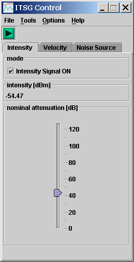

Inyecta señales de test en el receptor, visualizables con todas las vistas de datos crudos:

| Tipo | Descripción | Range stop |
|---|---|---|
| `Intensity` | señal continua con distintos niveles de intensidad | 50 km |
| `Velocity` | señal pulsada con distintos niveles de velocidad e intensidad; el ancho de pulso es el del transmisor | 1 km |
| `Noise` | ruido blanco a lo largo de 0–50 km | 50 km |

**La disponibilidad depende de la configuración del receptor.** El MMI selecciona el `range stop`
automáticamente para que la señal se vea bien (un rango grande con la señal pulsada la dejaría en
unos pocos píxeles).

**Controles:** casilla de modo por tipo de señal (desmarcar + enviar = apagar), deslizador de
atenuación (los valores son nominales y no se traducen exactamente a la salida; el nivel
calibrado realmente inyectado se muestra en el panel de intensidad), velocidad nominal (con
indicación de la velocidad no ambigua actual, porque la medida se pliega al rango de Nyquist),
ENR de la fuente de ruido, y botón `Set`.

**Avisos operativos que la UI debe dar:** conviene apagar la alta tensión para inyectar solo la
señal de test; si se cambian parámetros desde el Scan Worksheet hay que apagar `TX correction`;
**durante la ejecución de un scheduler el ITSG se apaga solo**; y al cerrar la ventana con señal
inyectada, el sistema pregunta si se debe seguir inyectando.

**Componentes:** `TestSignalCard`, `AttenuationSlider`, `CalibratedLevelReadout`,
`NyquistFoldingHint`, `SetAction`, `LeaveWithSignalDialog`.

## I3 — Waveform Generator (WFG)

**P2 · MANT.** Origen: RAVIS §7.5. Solo con generador de forma de onda instalado, necesario para
recuperación de segundo trip.

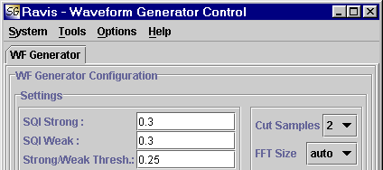

**Parámetros editables:** `SQI Strong` (umbral para el trip más fuerte), `SQI Weak` (para el más
débil, tras el filtrado), `Strong/Weak Threshold`, `Cut Samples` (2, 4 u 8 — el número real de
puntos FFT recortados es `FFT/cut + 1`), `FFT size` (define el patrón de fase aplicado a los
pulsos; cuanto mayor, mejor resultado), `Wave Start` (retardo de la forma de onda por ancho de
pulso, en pasos de 50 ns).

**Estado de solo lectura:** versión de software y número de serie del WFG, `WG System Status`
como **máscara de bits OR-eada** (`0x1` OK, `0x2` no presente, `0x4` modo diagnóstico, `0x100`
operando con fichero de pulso por defecto, `0x10000` error de comunicación, `0x20000` operando con
forma de onda por defecto por fichero corrupto, `0x30000` fallo al releer el pulso), modo
diagnóstico, `Trigger Gap [km]`, `Range Gap [km]`, `Range Gap Error [km]` (con signo: negativo =
los datos del segundo trip quedan más cerca del centro), cuatro temperaturas (canal A, canal B,
sección BiTE, sección digital) y cuatro tensiones (GND, +5 V, −5 V, +3.3 V).

**La máscara de bits OR-eada tiene que mostrarse como una lista de condiciones activas**, no como
`0x10100`. El mismo problema aparece en el estado del DSP (E12) y en el BiTE del DRX.

**Componentes:** `BitmaskStatusList`, `ParameterGroupCard`, `TemperatureGrid`, `VoltageGrid`.

## I4 — Notification Config

**P2 · MANT.** Origen: RAVIS §11 (*Email Messaging Window*).

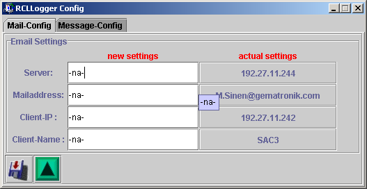

En Ravis, el RCP vigila los mensajes de proceso y los manda por correo. **Con la red air-gapped
esto no funciona tal cual**, pero la lógica de supervisión sí sobrevive y merece diseñarse como
"configuración de notificaciones", con el transporte por decidir.

**Lo que hay que conservar:**

- Destinatarios y transporte (en el legacy: servidor, direcciones separadas por punto y coma,
  IP y nombre del cliente; máximo 80 caracteres por línea; los campos que no se deben tocar se
  dejan en `-na-`).
- **Nominal vs actual**: la ventana muestra en la derecha los ajustes reales del RCP y en la
  izquierda los nuevos; al enviar con éxito, los nuevos aparecen a la derecha. Es el mismo patrón
  que en C3 y G2.
- Disparadores: notificar ante error, ante advertencia, o ambos.
- **Tiempo de recolección**: tras el primer error se acumulan mensajes durante N minutos antes de
  notificar. **Solo se anuncia la primera aparición**; las siguientes se ignoran hasta un reset.
- `Reset Errors/Warnings`: borra esa memoria para que el mismo error se vuelva a anunciar. Se
  deselecciona solo tras enviarse con éxito.
- Comportamiento tras reinicio: `Reset` (notificaciones apagadas) o `Permanent` (siguen activas).
- Botón de prueba (el legacy genera un correo de test con un adjunto de configuración).

**Componentes:** `NotificationConfigForm`, `NominalVsActualColumns`, `TriggerToggles`,
`CollectingWindowField`, `TestDeliveryAction`.

## I5 — Logger Config

**P2 · MANT.** Origen: RAVIS §5.2 (*Tools → Logger Configuration*). Qué se registra, a qué nivel
y dónde. Sin detalle en el manual; se documenta para que no se olvide.

## I6 — Export / Snapshot

**P1 · OP · transversal.** Origen: presente en **todas** las ventanas de Ravis (`Screen Shot`,
`Print`, `Save`, `Load`).

En lugar de repetirlo ventana por ventana, se diseña **una vez** y se reutiliza: exportar la
vista actual como imagen, exportar los datos como CSV/JSON, copiar al portapapeles, y —donde
aplique— guardar y recargar un conjunto de resultados para comparar (BiTE, linealidad, medidas
de calibración).

**Componentes:** `ExportMenu`, `SnapshotAction`, `MeasurementFilePicker`.

## I7 — Help / Docs

**P2 · OP.** Origen: RAVIS §5.2 (`Help → Overview`) y la ayuda contextual por tooltip que Ravis
ofrece en cada caja y botón (§4.1). La ayuda contextual **no es opcional** en este dominio: hay
~200 parámetros cuyo nombre no basta para saber qué hacen. El patrón (tooltip, popover, panel
lateral) hay que decidirlo una vez y aplicarlo en todas partes.

**Componentes:** `FieldHelpPopover`, `HelpPanel`, `GlossaryLink`.

---

# Catálogo de componentes

Columna **Estado**: `existe` = ya está en `mmi/src/components/` con story; `primitivo` = viene de
shadcn-vue, puede que haya que añadirlo; `nuevo` = hay que diseñarlo y construirlo.

Los nombres de props son una propuesta de partida, no un contrato. Los estados listados son los
que el componente **debe** saber representar; casi todos heredan además los cinco transversales
(`ok` / `warn` / `fault` / `disabled` / `stale`) y el eje de autoridad de control.

## Shell y mosaico

Consecuencia directa del paradigma decidido. Es el bloque que hay que diseñar primero, porque
condiciona el ancho disponible de todos los demás.

| Componente | Estado | Props | Estados a cubrir | Usado en |
|---|---|---|---|---|
| `AppShell` | nuevo | `statusBar`, `presets`, `mosaic` | conectado / desconectado / simulado / mantenimiento | A1 |
| `GlobalStatusBar` | nuevo | `authority`, `access`, `indicators`, `clocks`, `alarm` | nunca se oculta ni se tapa | A1 |
| `PanelMosaic` | nuevo | `layout` (1, 2, 3 o 4 paneles), `panels` | 1/2/3/4 paneles; panel activo | A1, D1 |
| `PanelFrame` | nuevo | `view`, `title`, `actions`, `maximized` | normal / maximizado / a un cuarto de pantalla / sin vista asignada | A1, D1 |
| `PanelViewPicker` | nuevo | `views`, `current` | agrupado por familia; marca las vistas ya abiertas en otro panel | A1 |
| `PresetBar` | nuevo | `presets`, `current`, `dirty` | preset aplicado / modificado sin guardar | A1 |
| `PresetManager` | nuevo | `presets` | crear, renombrar, restablecer; **preset que referencia una vista no aplicable** | A1 |
| `AuxPanelSlot` | nuevo | `content`, `placement` | paleta, parámetros de scan y overlay **dentro** del panel de su vista, no como panel propio | D1, D3, D6 |

## Primitivos

| Componente | Estado | Notas |
|---|---|---|
| `Button` | existe | variantes: default, secondary, destructive, ghost; tamaños compacto/normal |
| `Badge` | existe | |
| `Card` (+ Header/Title/Description/Content/Footer/Action) | existe | |
| `Input` | existe | |
| `Separator`, `ScrollArea` | existe | |
| `Select` | primitivo | muy usado en E y en las barras de las vistas de datos |
| `Tabs` | primitivo | pestañas de RSP Control, RX Linearity, BiTE actual/review |
| `Table` | primitivo | necesita variante **densa** |
| `Dialog` / `AlertDialog` | primitivo | base de `ConfirmDangerDialog` |
| `Tooltip` / `Popover` | primitivo | ayuda contextual (I7) |
| `Switch`, `Checkbox`, `RadioGroup` | primitivo | |
| `Slider` | primitivo | velocidad de antena (C1), atenuación del ITSG (I2) |
| `NumberField` | nuevo | con unidad, límites, paso, y mensaje de rango **antes** del error |
| `Toast` | primitivo | |
| `Progress` | primitivo | procedimientos largos |
| `Accordion`, `Command`, `Skeleton` | primitivo | |

## Estado y salud

| Componente | Estado | Props | Estados a cubrir | Usado en |
|---|---|---|---|---|
| `StatusLamp` | nuevo | `level`, `label`, `detail`, `stale`, `dimmed` | ok / warn / fault / disabled / stale / atenuado (subsistema no operativo) | B1, B2, B7 |
| `StatusLampRow` | nuevo | `label`, `level`, `value?`, `unit?`, `includedInAggregate` | + incluido/excluido del agregado | B2 |
| `StatusLampGrid` | nuevo | `items`, `columns` | denso | B2 |
| `SubsystemNode` | nuevo | `name`, `level`, `operational`, `selected` | 4 niveles + borde atenuado | B1 |
| `MimicLink` | nuevo | `from`, `to`, `animated`, `level` | animado / gris / rojo | B1 |
| `MimicDiagram` | nuevo | `nodes`, `links`, `commands` | pasivo / activo / desconectado | B1 |
| `CommandLamp` | nuevo | `label`, `state`, `pending`, `disabledReason` | on / off / en transición / bloqueado con causa | B1 |
| `AnalogGauge` / `LimitBar` | nuevo | `value`, `min`, `max`, `limits`, `unit` | dentro / en límite / fuera / sin dato | B3, B7 |
| `TrendChart` | nuevo | `series`, `window`, `paused`, `markers` | vivo / pausado / vacío / truncado a 8 h | B4 |
| `MetricTile` | nuevo | `label`, `value`, `unit`, `level`, `stale` | | B10, E12 |
| `TemperatureReadout`, `VoltageGrid` | nuevo | `readings`, `nominal`, `tolerance` | dentro / fuera de tolerancia (el DRX exige ≤40 °C y ±5 % en tensiones) | B10, E12, I3 |
| `UptimeDisplay` | existe | `startedAtWall` | | A7, B10 |
| `ProcessTable` | nuevo | `processes` | corriendo / caído / prioridad anómala | B5, E12 |
| `IndicatorBar` / `IndicatorLamp` | nuevo | `indicators` | ver A6 | A1, A6 |
| `ConnectionStatusBadge` | existe | `status`, `label` | | A1, A2 |
| `StaleBadge` | nuevo | `lastUpdate`, `threshold` | fresco / envejecido / muerto | transversal |
| `EnvironmentBadge` | nuevo | `env` | hardware real / simulador | A1 |
| `DiagnosticsBadge` | nuevo | `result`, `mask` | PASS / máscara de error decodificada | B10, E12 |
| `BitmaskStatusList` | nuevo | `value`, `bits` | lista de condiciones activas a partir de una máscara | I3, E12 |

## Mensajes y eventos

| Componente | Estado | Props | Estados | Usado en |
|---|---|---|---|---|
| `EventLogPanel` | nuevo | `events`, `autoScroll`, `filter` | vivo / pausado / vacío / truncado FIFO | A5 |
| `BiteMessageTable` | nuevo | `messages`, `sort`, `filter` | vivo / histórico / filtrado | B8, B9 |
| `SeverityChip` / `SeverityFilterBar` | nuevo | `level`, `counts` | info / warn / error, activo/inactivo | A5, B8 |
| `MessageDetailPanel` | nuevo | `message` | vacío / con contenido enriquecido | B8 |
| `TrafficLight` | nuevo | `level`, `acknowledged` | verde / amarillo / rojo; **una advertencia no baja un error previo** | A1, B8 |
| `FindBar` | nuevo | `query`, `matches` | | B8, I1 |
| `FaultBadgeRow` | existe | `fault`, `asBadge`, `showTimestamp` | | B1, B8 |
| `HistoricalModeBanner` | nuevo | `source`, `capturedAt` | | B9, G6 |

## Autoridad, acceso y acciones peligrosas

| Componente | Estado | Props | Estados | Usado en |
|---|---|---|---|---|
| `ControlAuthorityCard` | existe | `control`, `editable`, `actor`, `busy` | pasivo / activo / en transición | A1, A3 |
| `AuthorityToggle` | nuevo | `mode`, `pending` | + advertencia de descarte de scheduler | A3 |
| `AccessLevelGate` | nuevo | `level`, `required`, `reason` | permitido / bloqueado por nivel / bloqueado por autoridad | familias E, F, G, I |
| `MaintenanceBanner` | nuevo | `unlockedAt`, `expiresAt` | activo / por expirar | transversal |
| `DangerModeBanner` | nuevo | `mode`, `reason` | consola activa, depuración activa, simulación activa | I1, E10 |
| `ConfirmDangerDialog` | nuevo | `action`, `consequences`, `requireTyping?` | | transversal |
| `BlockedActionExplainer` | nuevo | `action`, `blockers[]` | una o varias causas, cada una con enlace a donde se resuelve | C4, B7, G1 |
| `SetSaveActions` | nuevo | `dirty`, `canSave`, `saveBlockedReason` | **`Set` = volátil, `Save` = persistente**; distinción visual obligatoria | B7, C5, E*, G2, G7 |
| `PasswordPrompt` | nuevo | `scope` | | A4, I1 |

## Antena

| Componente | Estado | Props | Estados | Usado en |
|---|---|---|---|---|
| `AntennaPositionReadout` | existe | `antenna`, `showRates` | | C1, H2 |
| `AxisSelector` | existe | `modelValue` | azimut / elevación | C1 |
| `AxisPositioningFields` | existe | `modelValue`, `axisLabel` | sin valores por defecto confirmados | C1 |
| `JogPad` | nuevo | `stepDeg`, `disabled`, `moving` | en movimiento / detenido / sin autoridad | C1, H2 |
| `VelocitySlider` | nuevo | `modelValue`, `min`, `max`, `unit` | | C1 |
| `ServoStatusPanel` | nuevo | `signals` | las seis señales de §7.2.2 | C1 |
| `LimitIndicator` | nuevo | `axis`, `lower`, `upper`, `returnEnabled` | dentro / en límite / retorno activo | C1 |
| `StepWidthSetup` | nuevo | `az`, `el` | rango 0.1–1.0° | C2 |
| `EmergencyStopButton` | nuevo | `onStop` | siempre habilitado si hay autoridad | C1 |
| `OffsetCalcPanel` | nuevo | `nominal`, `measured`, `offset`, `axis` | | H2 |
| `CapturePointMode` | nuevo | `active`, `target` | capturando desde PPI/RHI/ASCOPE | H2, D2–D4 |

## Parámetros y configuración

| Componente | Estado | Props | Estados | Usado en |
|---|---|---|---|---|
| `ParameterField` | nuevo | `label`, `value`, `unit`, `limits`, `help`, `accepted` | sin cambios / modificado sin aplicar / aplicado (confirmación en verde) / rechazado con rango | C3, E*, G* |
| `ParameterGroupCard` | nuevo | `title`, `fields`, `density` | | C3, E* |
| `TernaryOverrideField` | nuevo | `modelValue` | Never / User / Always | E2 |
| `ConditionalFieldGroup` | nuevo | `discriminator`, `cases` | el juego de campos cambia con el tipo | E4, E6, E7 |
| `NominalVsActualTable` | nuevo | `rows` (pedido, real, ¿coinciden?) | igual / distinto / sin dato real | C3, E12, I4 |
| `ConfigDiffView` | nuevo | `left`, `right` | añadido / cambiado / eliminado | E11 |
| `ProfileActionsBar` | nuevo | `dirty`, `savedVersion` | current / saved / factory | E11 |
| `ThresholdMatrix` | nuevo | `params`, `thresholds` | solo lectura o editable (por decidir) | E3 |
| `FlagExpressionDisplay` | nuevo | `mask`, `symbols` | muestra `LOG & CSR`, no `0x8888`; solo lectura | E3 |
| `TriggerTimingTable` | nuevo | `triggers` | 6 filas start/width/polaridad | E6 |
| `PrtTermField` | nuevo | `base`, `prtFactor` | admite `x µs + k·PRT` | E6 |
| `PulseWidthSelector` | nuevo | `widths`, `current` | persistente entre vistas de E y F | C3, E6, G* |
| `SectorBlankingEditor` + `AzimuthSectorDial` | nuevo | `sectors`, `constraints` | válido / solapado / excede tamaño máximo | C5, E5 |
| `PinMapEditor` | nuevo | `pins` (25) | | E7, F5 |
| `BitMaskEditor` / `BitToggleGrid` | nuevo | `value`, `width`, `labels` | por bit o por pin | E9, F5 |
| `RangeLayoutEditor` | nuevo | `start`, `stop`, `step`, `average` | valida `step/average ≥ 62.5 m` | C3 |
| `DataTypeSelector` | nuevo | `available`, `selected` | disponible / no disponible con los ajustes actuales | C3, D2–D4 |
| `PolarizationModeSelector` | nuevo | `mode`, `capabilities` | con las limitaciones de cada modo visibles | C3 |
| `CrossCheckExplainer` | nuevo | `field`, `blockedBy` | "no puedes elegir esto **porque** aquello" | C3 |
| `ValidationSummary` | nuevo | `issues` | | C3, C5, E* |
| `RestartRequiredNotice` | nuevo | `change` | | E9 |
| `EquationPanel` | nuevo | `equation`, `highlight` | resalta los términos que el usuario edita | G7 |

## Vistas de datos

| Componente | Estado | Props | Estados | Usado en |
|---|---|---|---|---|
| `ScopePlot` | nuevo | `series`, `xUnit`, `aggregation`, `zoom` | vivo / congelado / sin datos | D2 |
| `PpiPlot` | nuevo | `rays`, `palette`, `zoom`, `center` | + centro desplazado | D3 |
| `RhiPlot` | nuevo | `rays`, `palette`, `zoom` | | D4 |
| `SpectrumPlot` | nuevo | `bins`, `scale` | | D5, F2 |
| `AntennaSweepLine` | nuevo | `angle`, `rate` | | D3, D4 |
| `OverviewInset` | nuevo | `full`, `viewport` | | D3 |
| `ColorScaleLegend` | nuevo | `palette`, `dataType`, `unit` | | D3, D4, D6 |
| `ColorTableEditor` + `ColorSwatchGrid` + `ColorChooser` | nuevo | `presets`, `dataType` | preset modificado / guardado / por defecto | D6 |
| `OverlayLayerList` | nuevo | `layers` | 6 capas con visibilidad y color | D7 |
| `CursorReadout` | nuevo | `distance`, `az`, `el`, `height?`, `value`, `unit` | fijado / siguiendo / actualizándose con cada dato | D2–D4 |
| `FreezeToggle` | nuevo | `frozen` | congela **solo esta vista** | D2–D4 |
| `ResolutionSelector` | nuevo | `value` | 16…256; avisa del coste de ancho de banda | D2–D4 |
| `ZoomControl`, `RefreshRateSelector`, `DataSourceSelector` | nuevo | | | D2–D4 |
| `AxisUnitToggle` | nuevo | `unit` | km / µs | D2 |
| `PixelAggregationToggle` | nuevo | `mode` | maximum / average | D2 |

## Plots de ajuste (familia F)

| Componente | Estado | Props | Estados | Usado en |
|---|---|---|---|---|
| `AdjustmentPlotFrame` | nuevo | `plot`, `staticInfo`, `liveStatus`, `controls` | **el patrón común de F1–F4** | F1–F4 |
| `LiveStatusLine` | nuevo | `fields` | vivo / congelado (single step) / `No Trigger` | F1–F4 |
| `NudgeControl` | nuevo | `value`, `fineStep`, `coarseStep`, `unit` | la convención minúscula/mayúscula del legacy | F1–F4 |
| `WaveformPlot` | nuevo | `samples`, `zoom`, `windows[]` | dibuja **dos ventanas** (FIR y AFC) cuando difieren | F1 |
| `PlotSpanSelector` | nuevo | `value` | pasos 2…5000 µs | F1 |
| `AmplitudeZoomSelector` | nuevo | `value` | ×1…×128 | F1–F4 |
| `AveragingSelector` | nuevo | `value` | 1–25 | F2–F4 |
| `IfChannelSelector` | nuevo | `channel` | 5 entradas SMA | F1–F3 |
| `SingleStepControl` | nuevo | `paused` | vivo / pausado / paso a paso | F1–F4 |
| `LogToFileToggle` | nuevo | `recording`, `target` | | F1, F3 |
| `AfcStatePill` | nuevo | `state`, `level`, `encoded?` | los seis estados de F2, con historia reciente | F2, B10 |
| `OptimalSearchDialog` | nuevo | `spans`, `progress` | configurando / buscando / abortado / terminado | F2, F4 |
| `SignalLevelGuide` | nuevo | `target`, `max` | bandas objetivo (−3…+4 dBm) y máximo (+8 dBm) sobre el plot | F1 |
| `BitPatternTester` + `WalkingOnesControl` + `PinBitModeSwitch` | nuevo | `value`, `mode` | | F5 |

## Procedimientos

| Componente | Estado | Props | Estados | Usado en |
|---|---|---|---|---|
| `JobActionPanel` | existe | `busy`, `jobId`, `result`, `error`, etiquetas | | C4, G5 |
| `WizardStepper` | nuevo | `steps`, `current` | pendiente / activo / hecho / fallido / omitido | G2–G4, H2 |
| `PrecheckList` | nuevo | `checks` | cada precondición con su estado en vivo y su causa | C4, G1 |
| `RoutineStepper` | nuevo | `steps`, `result` | **completada / fallida / interrumpida** (tres resultados) | C4 |
| `OperatorPromptDialog` | nuevo | `prompt`, `inputSpec` | el script pide una medida al operador | G3, G4 |
| `CalibrationResultTable` | nuevo | `results`, `saved` | | G4, G6 |
| `UnsavedResultBanner` | nuevo | `what` | resultado obtenido pero volátil | G4, G7 |
| `WarmupTimer` | nuevo | `since`, `required` | los 20 min de radiación previos a calibrar TX | G3 |
| `LongOperationProgress` | nuevo | `progress`, `timeout` | incluye el caso "se aborta a los 40 s" de la ACU | H2 |
| `ManualRefreshBar` | nuevo | `lastRefresh` | **"estos datos no se actualizan solos"** | G2, B8 (DRX BiTE) |
| `ProcedureResultBanner` | nuevo | `status`, `logLink` | éxito / `ERROR` con enlace al log | G2–G4 |

## Sol y utilidades

| Componente | Estado | Props | Usado en |
|---|---|---|---|
| `SunPathPlot` | nuevo | `path`, `current`, `visible` | H1 |
| `SunAzimuthCompass` | nuevo | `azimuth`, `elevation` | H1 |
| `DateTimeLocationForm` | nuevo | `date`, `localTime`, `utc`, `lat`, `lon` | H1 |
| `ClockSourceBadge` | nuevo | `source` (GPS / sistema) | H1, A1 |
| `CommandConsole` + `CommandHistory` + `ConsoleModeBadge` | nuevo | `mode`, `lines` | I1 |
| `TestSignalCard` + `AttenuationSlider` | nuevo | `type`, `enabled`, `level` | I2 |
| `NotificationConfigForm` | nuevo | `nominal`, `actual` | I4 |
| `ExportMenu` / `SnapshotAction` | nuevo | `targets` | transversal |
| `FieldHelpPopover` / `HelpPanel` | nuevo | `term`, `content` | transversal |
| `InfoTree` / `KeyValueTable` | nuevo | `nodes` | A7, D8 |

**Total: ~127 componentes**, de los cuales 8 existen hoy y ~15 son primitivos de shadcn-vue.
El resto hay que diseñarlos.

---

# Semántica transversal que el diseño debe fijar una sola vez

| Eje | Valores | Dónde aparece |
|---|---|---|
| Salud | `ok`, `warn`, `fault` | todas las lámparas, marcos de subsistema, semáforo BiTE |
| Disponibilidad | `disabled` (sin conexión), `stale` (conexión sin datos), `dimmed` (subsistema no operativo ⇒ sus datos no son actuales) | A6, B1, B2, B7 |
| Procedencia | `live`, `manual-refresh` (el DRX solo reporta bajo petición), `historical`, `simulated` | G2, B9, G6, A1 |
| Autoridad | con control / sin control | todos los controles de escritura |
| Acceso | `OP` / `MANT` | familias E, F, G, I |
| Persistencia | aplicado volátil (`Set`) / persistido (`Save`) / de fábrica (`Factory`) | B7, C5, E*, G2, G7 |
| Edición | sin cambios / modificado sin aplicar / aplicado y aceptado / rechazado con rango | C3, E*, G* |
| Modo peligroso | consola activa, depuración activa, mantenimiento desbloqueado | I1, E10, A4 |

Ocho ejes independientes que se combinan. **Esta es la parte más difícil del encargo**: un campo
puede estar simultáneamente modificado-sin-aplicar, en un sistema sin autoridad de control, con
datos envejecidos, en modo simulado. El diseño tiene que decidir qué se representa con color, qué
con tipografía, qué con iconografía y qué con texto, sin que cuatro señales compitan por el mismo
píxel.

# Requisitos de concurrencia (base de los presets)

Casos documentados en los manuales donde **hacen falta varias vistas a la vez**. Con el paradigma
decidido, **cada fila de esta tabla es candidata a ser un preset del mosaico**; las de cuatro
vistas son las que fijan el máximo de cuatro paneles:

| Procedimiento | Vistas simultáneas | Fuente |
|---|---|---|
| Ajuste del muestreo del pulso TX | Scan Worksheet + ASCOPE + RSP TX/RX Adjustment | RAVIS §14.2.1 |
| Corrección de azimut por sol | Antenna Control + PPI + Sun Position | RAVIS §10.3.2.1 |
| Corrección de elevación por sol | Antenna Control + Scan Worksheet + RHI + Sun Position | RAVIS §10.3.2.2 |
| Ajuste fino az/el | Antenna Control + Scan Worksheet + ASCOPE + Sun Position | RAVIS §10.3.2.3 |
| Diseño del filtro adaptado | `Mb` ↔ `Pb` ↔ `Ps`, ciclando entre ellos | RVP §5.2 |
| Ajuste del ITSG | ITSG Control + ASCOPE | RAVIS §7.8.1 |
| Calibración con log abierto | cualquier procedimiento + Calibration Log | RAVIS §7.4 |
| Vigilancia permanente | BiTE + alarmas + cualquier otra cosa | RAVIS §9 |

Además: en Ravis se pueden abrir **varios ASCOPE, PPI y RHI a la vez** (para comparar tipos de
dato), y cada uno se congela independientemente.

# Orden sugerido de trabajo

No es un plan de proyecto; es el orden en que el diseño rinde más:

1. **Fundamentos** — sistema de color con los ocho ejes de estado, escala de densidad,
   tipografía numérica (tabular, obligatorio), patrón de `Set`/`Save`, patrón de acción
   bloqueada, ayuda contextual. Sin esto, todo lo demás se rehace.
2. **Shell y mosaico** — `AppShell`, `GlobalStatusBar`, `PanelMosaic`, `PanelFrame`, presets, y
   **los dos anchos de referencia** (panel a un cuarto de pantalla y a pantalla completa) contra
   los que se diseñará cada vista. Va antes que cualquier vista concreta.
3. **P0 de operación** — A1, A3, A5, A6, B1, B8, B10, C1, C3, C4.
4. **P0 de datos** — D1–D4 con D6 (paleta) y D8.
5. **P1 de mantenimiento** — familia G completa, B7, C5.
6. **P1 de DSP** — E1–E7, E11, E12 y F1–F3.
7. **P2** — el resto.

# Trazabilidad legacy → vista

| Fuente | Sección | Vista(s) |
|---|---|---|
| Ravis | §5 Main Control Center | A1, A5 |
| Ravis | §6 Connect and Login | A2, A3, A6 |
| Ravis | §7.1 System Visualization | B1, B2, B3, B4, B5, B6 |
| Ravis | §7.2 Antenna Control | C1, C2 |
| Ravis | §7.3 Scan Worksheet | C3 |
| Ravis | §7.4 RSP (DRX) Control | G1, G2, G4, G7, C5, E12 |
| Ravis | §7.5 Signal Generator Control | I3 |
| Ravis | §7.6 RX Linearity Validation | G6 |
| Ravis | §7.7 Power Monitor | B7 |
| Ravis | §7.8 ITSG Control | I2 |
| Ravis | §8 Data Views | D1–D8 |
| Ravis | §9 BiTE Message Window | B8, B9 |
| Ravis | §10 Sun Position Utility | H1, H2 |
| Ravis | §11 Email Messaging | I4 |
| Ravis | §12 Ravis Console | I1 |
| Ravis | §13 System Information | A7 |
| Ravis | §14 Calibration and Alignment | G2, G3, G4, G7 |
| RVP900 | §4.1 Overview / `V` / `Vz` / `Vp` / `@` | E1, E3, E11, E12, B10 |
| RVP900 | §4.2.1 `Mc` | E9 |
| RVP900 | §4.2.2 `Mp` | E2 |
| RVP900 | §4.2.3 `Mf` | E4 |
| RVP900 | §4.2.4 `Mt` | E5, C5 |
| RVP900 | §4.2.5 `Mt<n>` | E6 |
| RVP900 | §4.2.6 `Mb` | E7 |
| RVP900 | §4.2.7 `M+` | E10 |
| RVP900 | §4.2.8 `Mz` | E8 |
| RVP900 | §5.1 `P+` | F6 |
| RVP900 | §5.3 `Pb` | F1 |
| RVP900 | §5.4 `Ps` | F2, F5 |
| RVP900 | §5.5 `Pr` | F3 |
| RVP900 | §5.6 `Pa` | F4 |
| RVP900 | §7.9 `GPARM` | E12 |
| RVP900 | Apéndice F (panel RCP902) | — (es un ICD de hardware; alimenta las señales de I2 y de los triggers de E5, no una vista) |

**No trazado a ninguna vista, a propósito:** capítulos 1–3 y 6 del RVP900 (información general,
especificaciones, algoritmos de procesamiento), apéndices A–E y G–H, y los capítulos 2–4 de
Ravis (concepto, features, getting started). Son teoría, hardware o material de referencia, no
superficie de interfaz. Los algoritmos del capítulo 6 del RVP900 **sí** son la fuente de verdad
para las ayudas contextuales de los parámetros de C3 y de la familia E.

# Decisiones abiertas para el equipo

Cosas que este inventario **no** resuelve y que hay que cerrar con el equipo antes o durante el
diseño:

1. ~~**Paradigma de ventanas.**~~ **Cerrado (2026-09-19): shell fijo + mosaico de 1–4 paneles con
   presets por tarea.** Descartados el workspace acoplable con segundo monitor y las rutas puras.
   Queda por concretar, ya dentro del diseño: los dos anchos de referencia por vista, el
   encabezado común de panel, y la gestión de presets (crear, renombrar, restablecer, preset que
   referencia una vista no aplicable).
2. **La alarma sonora** existe en Ravis (B1, *Options → Sound*). ¿La mantenemos? ¿Con qué
   escalado? Es decisión de producto.
3. ~~**E3 (matriz de umbrales): ¿solo lectura o editable?**~~ **Cerrado (2026-09-19): solo
   lectura de momento.** Si el contrato RCP↔DSP acaba exponiendo escritura de umbrales, se
   reabre y entonces hace falta el editor de expresiones `TCF`.
4. **B6 (pares remotos y mensajería).** Con operador único y red air-gapped recomendamos
   reducirlo a una lista dentro de A7 y descartar la mensajería. Falta confirmación.
5. **I4 (notificaciones).** El correo del legacy no aplica en red air-gapped. ¿Qué transporte?
   ¿Notificación local, registro, señalización externa?
6. **Expiración del modo mantenimiento (A4).** Recomendamos que expire por inactividad; hay que
   fijar el plazo.
7. **Qué campos del DSP son realmente nuestros.** La familia E está calcada del RVP900 porque
   documenta el volumen y la naturaleza del problema. El contrato real lo fija el proyecto DSP
   (`interfaces/dsp.md`), y el mapeo campo a campo está sin hacer. **Diséñense los patrones, no se
   cablee esta lista.**
8. **Paletas de datos (D6).** ¿Se parte de paletas perceptualmente uniformes, o hay que reproducir
   una paleta institucional concreta por compatibilidad con lo que el personal ya lee?
9. ~~**Densidad y tamaño de pantalla.**~~ **Cerrado (2026-09-19): escritorio ≥1920×1080, ratón y
   teclado, sin táctil**, tal y como se había asumido. Ancho de referencia estrecho ≈960×480 px
   (un panel de cuatro), ancho amplio = panel a pantalla completa.
10. **Rango de idioma.** Etiquetas en inglés según lo decidido; queda por ver si el personal
    operativo local lo prefiere así en las pantallas de operación diaria (A, B, C) aunque las de
    mantenimiento (E, F, G) se queden en inglés por fuerza.

---

## Material de origen

- `legacy/ravis/` — 150 imágenes del *Ravis 1.3 Operator's Manual* (Rel. 2.0, 2003-07-28).
  Incluye capturas completas de ventana e iconos recortados; este documento referencia las
  capturas útiles, y el resto queda disponible por si el diseño quiere ver un detalle concreto.
- `legacy/rvp900/` — 77 imágenes del manual del RVP900 (M211322EN-B). Las relevantes para
  interfaz son los plots del capítulo 5 (`img-025` a `img-034`).
- Manuales completos en el repositorio `lamula-dsp`: `ravis/manual.md`, `rvp900/rvp900_manual.md`,
  con marcadores `<!-- PDF page N -->` para localizar cualquier sección citada aquí.
