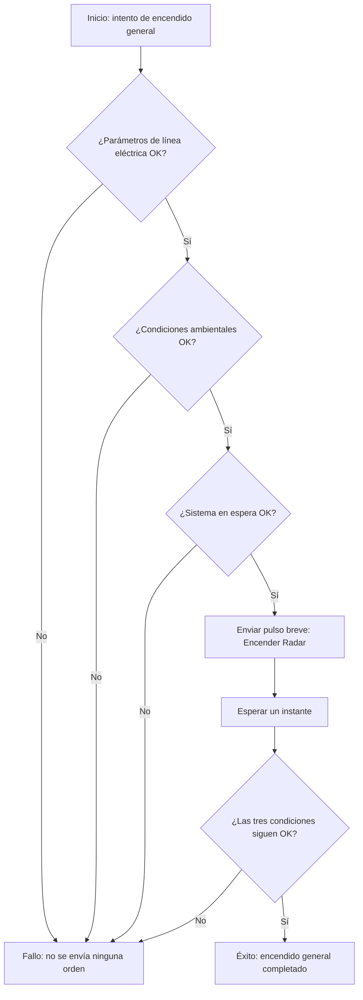
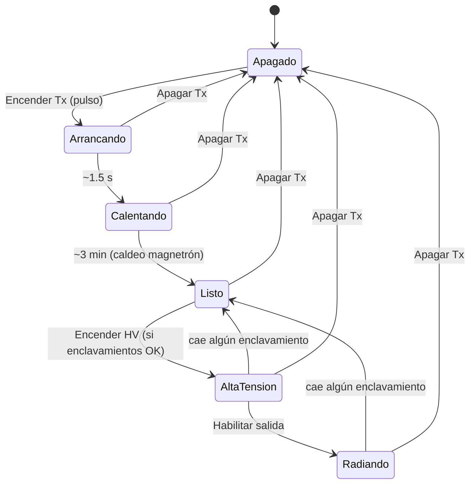

# Rutinas de control del radar

Esta página describe, en lenguaje operativo (no de programación), cómo el software del RCP
enciende y controla el radar paso a paso. Está pensada para que alguien con experiencia operando
el radar real (product expert) pueda revisar si la secuencia es correcta, aunque no lea código.

El plan del proyecto define **seis rutinas de control**: encendido general, encendido del
transmisor, encendido del receptor analógico, encendido de la unidad de antena, movimiento de
antena y posicionamiento de antena. Cada una automatiza una secuencia que, en el radar original,
hacía el operador a mano desde el panel de control.

!!! danger "Por qué esta página existe"
    El plan del proyecto nombra las seis rutinas pero **no fija el procedimiento interno de
    ninguna** — eso es responsabilidad de este equipo, no algo copiado de un manual del
    fabricante. Cada rutina de esta página necesita revisión de alguien que conozca el
    procedimiento real antes de confiar en ella para algo más que pruebas contra el simulador.

## Rutina 1 — Encendido general del radar

**Estado:** implementada y probada contra el simulador del radar. No probada contra hardware
real.

### Qué revisa antes de encender

Antes de intentar el encendido, el sistema comprueba que estas tres condiciones estén en buen
estado:

1. **Parámetros de línea eléctrica correctos** (señal `sys.line_parameters_ok_status`).
2. **Condiciones ambientales correctas** (señal `sys.environment_ok_status`).
3. **Sistema en espera (standby) correcto** (señal `sys.standby_system_ok_status`).

Si **cualquiera** de las tres no está en buen estado, el sistema **no envía ninguna orden** al
radar y reporta el intento como fallido.

### Qué hace al encender

Si las tres condiciones están bien, el sistema envía una orden breve de "Encender Radar" — como
pulsar un botón momentáneamente, no como sostener un interruptor. Esto es así porque, según la
documentación del equipo de simulación, el radar interpreta esta orden como un pulso (una
presión de botón), no como un nivel sostenido: si dos órdenes opuestas ("Encender" / "Apagar")
estuvieran activas a la vez, gana apagar, por seguridad.

### Cómo se determina si funcionó

Después de enviar el pulso, el sistema espera un instante y vuelve a revisar las mismas tres
condiciones. Si siguen bien, considera el encendido exitoso.

!!! question "Para el experto: revisar antes de confiar en esta rutina"
    - ¿Es correcto el conjunto de estas tres condiciones, y en este orden, para el procedimiento
      real de encendido general? Se dedujeron de los nombres disponibles en el catálogo de
      señales del radar, no de un manual ni de un procedimiento operativo confirmado.
    - ¿Existe, en el radar real, alguna señal de "radar encendido" que debiéramos usar como
      confirmación directa? Hoy no existe ninguna en el catálogo disponible — el éxito se infiere
      de que las tres condiciones de arriba "sigan bien" después del pulso, no de una lectura que
      diga explícitamente "encendido".

### Diagrama de la secuencia

Las siguientes cinco rutinas todavía no tienen código — lo que sigue es el **diseño propuesto**
para cada una, deducido del comportamiento del simulador del radar (`radar_emulator`), que hoy es
la única referencia disponible del lado del equipo. Se documentan aquí, antes de programarlas,
precisamente para que el experto las revise primero y no después.

## Rutina 2 — Encendido del transmisor

**Estado:** diseño propuesto, sin implementar. Es la única de las seis rutinas donde el
simulador del radar sí reproduce una secuencia interna con tiempos y enclavamientos — las demás
son más simples porque el simulador no les modela ese comportamiento (ver aviso al final de esta
sección).

### Enclavamientos de seguridad que deben estar bien antes de continuar

Antes de subir alta tensión, deben estar en buen estado, todos a la vez:

1. Interlock físico del transmisor.
2. Presión de guía de onda correcta.
3. Radomo cerrado **y** sistema en espera correcto (el radomo abierto corta este enclavamiento).
4. Soplador de la cabina funcionando.
5. Soplador del magnetrón funcionando.
6. Secuencia de fases correcta.
7. Ciclo de trabajo (duty cycle) dentro de límite.

### Secuencia propuesta

1. **Encender transmisor:** se envía una orden breve "Encender Tx" (pulso, como en la Rutina 1).
   Arrancan sopladores y fuentes de alimentación del transmisor.
2. **Calentamiento inicial (~1,5 segundos):** tiempo corto de arranque antes de pasar a
   calentamiento del magnetrón.
3. **Calentamiento del magnetrón (~3 minutos):** el transmisor queda encendido pero no listo para
   alta tensión hasta que termine este tiempo de caldeo.
4. **Listo:** terminado el caldeo, el transmisor queda en estado "listo", esperando la orden de
   alta tensión.
5. **Encender alta tensión:** si en ese momento **todos** los enclavamientos de la lista de
   arriba siguen en buen estado, se envía la orden "Encender HV" y el transmisor queda con alta
   tensión aplicada.
6. **Habilitar salida:** con una orden adicional el transmisor pasa a "radiando".
7. **Apagado:** la orden "Apagar Tx" funciona desde cualquier punto de la secuencia y corta todo
   de inmediato — es la orden de mayor prioridad, por seguridad.
8. **Caída de un enclavamiento en caliente:** si algún enclavamiento de la lista deja de estar
   bien mientras el transmisor tiene alta tensión o está radiando, la alta tensión se retira
   automáticamente (vuelve a "listo"), pero el transmisor **no se apaga por completo** — sigue
   caliente, listo para otro intento sin repetir el calentamiento.

### Falla que el sistema vigila por sí mismo

Si la corriente pico del magnetrón supera un umbral, el sistema marca una falla de sobrecorriente
que se queda activa (enclavada) hasta que se envíe explícitamente la orden de "reset de fallas" —
no se limpia sola aunque la corriente baje.

!!! question "Para el experto: revisar antes de implementar esta rutina"
    - Los tiempos de arriba (1,5 s de arranque, **3 minutos de caldeo del magnetrón**) son valores
      de marcador de posición puestos por el equipo de simulación — el propio simulador los
      marca como pendientes de confirmar. ¿Cuál es el tiempo real de caldeo del magnetrón del
      RD100S?
    - El umbral de sobrecorriente pico del magnetrón que dispara la falla también es un valor de
      marcador de posición. ¿Cuál es el umbral real?
    - ¿El radomo realmente forma parte de la cadena de enclavamiento del transmisor en el RD100S,
      o eso es una particularidad del simulador que no aplica al radar real?
    - ¿"Encendido del transmisor" (la rutina de esta sección) debe llegar hasta "listo" nada más,
      o debe incluir también subir alta tensión y empezar a radiar? El plan no lo distingue —
      podría ser que subir HV y radiar sean parte de arrancar un escaneo, no de esta rutina.

### Diagrama de estados

## Rutina 3 — Encendido del receptor analógico

**Estado:** diseño propuesto, sin implementar. El simulador no modela ninguna secuencia interna
para el receptor — es una rutina simple, parecida en forma a la Rutina 1.

### Qué revisaría antes de encender

- Las tres fuentes de alimentación del receptor (+15 V, −15 V, +12 V) en buen estado.

### Qué haría al encender

Enviar una orden breve "Encender RFE" (pulso, mismo patrón que Rutina 1 y Rutina 2).

### Cómo se determinaría el éxito

Confirmar que el front-end de recepción (RFE) queda encendido y que el oscilador local (STALO)
está enganchado (locked) — sin oscilador enganchado, el receptor no puede procesar señal aunque
esté "encendido".

!!! question "Para el experto: revisar antes de implementar esta rutina"
    - ¿Hay algún tiempo de espera entre encender el RFE y que el oscilador local se enganche, o
      es prácticamente inmediato? El simulador no modela esto, así que no hay ninguna pista de
      cuánto tardaría en el radar real.
    - ¿Hay alguna condición de enclavamiento (como en el transmisor) que deba revisarse antes de
      encender el receptor, o basta con las tres fuentes de alimentación?

## Rutina 4 — Encendido de la unidad de antena

**Estado:** diseño propuesto, sin implementar.

### Qué revisaría antes de encender

- Radomo cerrado.

### Qué haría al encender

Enviar la orden de encendido de la unidad de antena.

### Cómo se determinaría el éxito

Confirmar que la unidad de antena queda encendida, y que los variadores de azimut y elevación
reportan buen estado.

!!! question "Para el experto: revisar antes de implementar esta rutina — señal atípica"
    A diferencia de las otras cinco rutinas, el catálogo de señales tiene **una sola orden** para
    esta ("encender/apagar unidad de antena"), no un par separado de "Encender" / "Apagar" como
    en encendido general, transmisor y receptor. Eso puede significar que es un interruptor de
    nivel (se mantiene apretado/sostenido) en vez de un pulso momentáneo como las demás — **rompe
    el patrón de las otras rutinas y necesita confirmación explícita** de cómo se opera
    realmente antes de programarla.

## Rutina 5 — Movimiento de antena

**Estado:** implementada y probada contra el simulador del radar (ver
`spike-fase2/RESULTADO-antenna-movement.md`). No probada contra hardware real. Es la primera
rutina que controla algo con inercia real (la antena no cambia de velocidad instantáneamente).

!!! warning "Corrección sobre lo descrito más abajo (2026-08-19)"
    Esta sección seguía describiendo la rutina como "enviar una velocidad deseada en grados/s".
    Al implementarla se confirmó que la señal real del hardware (la referencia que recibe el
    variador) está en **voltios** (±10 V), no en grados/s — es una entrada analógica a un
    variador, igual que en el radar real. No existe hoy una ganancia real del RD100S para
    traducir grados/s a voltios (el simulador usa una ganancia propia marcada como pendiente de
    confirmar). La rutina implementada (`core/control_routines/antenna_movement.py`) recibe la
    referencia directamente en voltios y **no confirma la magnitud** de la velocidad alcanzada —
    solo el sentido de giro y que el eje efectivamente arranca o se detiene. Traducir una
    velocidad deseada en grados/s a esta referencia de voltios queda pendiente de esa ganancia
    real (PEND-RCP-07).

### Qué debe estar listo antes de mover

- La unidad de antena encendida (Rutina 4 completada).
- El variador del eje que se va a mover (azimut o elevación) habilitado.

### Qué haría al mover

Enviar una velocidad deseada al eje correspondiente. La antena acelera de forma gradual (no
instantánea) hasta esa velocidad y la mantiene.

### Protecciones mientras se mueve

- **Elevación** tiene topes físicos de fin de carrera (aproximadamente −1,5° y 91,5° en el
  simulador — valores de marcador de posición pendientes de confirmar): si el eje llega a un
  tope, el movimiento en esa dirección se detiene solo, aunque se siga pidiendo esa velocidad.
- **Azimut** no tiene tope (gira continuo en círculo), pero sí protección térmica: si el motor
  exige demasiada corriente (más de 30 A, valor de marcador de posición) durante demasiado tiempo
  seguido (5 s equivalentes), el sistema lo detiene para no dañarlo, y esa protección solo se
  rearma al volver a encender la unidad de antena.

### Cómo se determinaría el éxito o la interrupción

Confirmar que el eje efectivamente alcanza (aproximadamente) la velocidad pedida, y detectar si
se activó algún tope o la protección térmica para reportarlo como movimiento interrumpido, no
como error silencioso.

!!! question "Para el experto: revisar antes de implementar esta rutina"
    - Los límites de elevación y el umbral de protección térmica de azimut son valores de
      marcador de posición del simulador. ¿Cuáles son los límites y umbrales reales del RD100S?
    - **Azimut** tiene protección térmica del motor modelada en el simulador; **elevación no**
      (solo fin de carrera físico, sin protección térmica de motor). ¿Es correcto que elevación no
      la necesite, o es un hueco del simulador que igual deberíamos cubrir en el RCP por
      seguridad?

!!! note "Corrección (2026-08-19)"
    Esta sección decía antes lo contrario: que elevación tenía protección térmica y azimut no. Al
    verificar contra `radar_emulator/config/rd100s.seed.json` para implementar la guarda de
    seguridad de parámetros (ver más abajo) se confirmó que es al revés — el único bloque `i2t`
    de la semilla calcula `ant.i2t_drive_az_status` (azimut); la señal `ant.i2t_drive_el_status`
    existe en el catálogo pero no tiene ningún bloque que la calcule (sin cablear).

## Rutina 6 — Posicionamiento de antena

**Estado:** implementada y probada contra el simulador del radar (ver
`spike-fase2/RESULTADO-antenna-positioning.md`). No probada contra hardware real. A diferencia de
las otras cinco, la rutina implementada (`core/control_routines/antenna_positioning.py`) **no
fija ningún valor propio de ganancia, tolerancia ni tiempo máximo** — los exige como parámetros
obligatorios de quien la llame, precisamente porque no hay ningún valor real ni siquiera
aproximado (ni del simulador) que usar como default. Es la rutina más distinta de las seis: el radar
solo acepta una **orden de velocidad**, nunca una orden de "ir a esta posición exacta" — ese
lazo de control (medir dónde está, calcular hacia dónde y qué tan rápido moverse, y frenar al
llegar) lo tiene que resolver el software del RCP, apoyándose en la Rutina 5. El simulador del
radar no da ninguna pista de cómo debería comportarse este lazo — es diseño nuevo, no algo que se
pueda deducir de él.

### Qué haría, en términos generales

1. Leer la posición actual de azimut/elevación.
2. Calcular cuánto falta para llegar a la posición pedida.
3. Pedir una velocidad (vía la Rutina 5) proporcional a esa distancia: rápido si falta mucho,
   despacio si falta poco.
4. Cuando la posición esté dentro de un margen aceptable del objetivo, detener el movimiento.

!!! question "Para el experto: esta rutina necesita definirse desde cero"
    - ¿Qué tan preciso debe ser el posicionamiento final (margen de tolerancia en grados)?
    - ¿Hay un tiempo máximo esperado para posicionar, después del cual debería reportarse como
      fallo en vez de seguir esperando?
    - ¿El acercamiento final debe frenar de forma gradual (como se describe arriba) o el radar
      real tiene su propio comportamiento de frenado que deberíamos imitar?

!!! warning "Limitación conocida de la implementación (2026-08-19)"
    El control proporcional simple implementado no calcula distancia de frenado contra la
    aceleración limitada del eje (Rutina 5): decide "ya estoy en tolerancia" y ahí recién manda a
    frenar, así que puede terminar más lejos del objetivo que el margen pedido mientras el eje
    completa la desaceleración. Ver `spike-fase2/RESULTADO-antenna-positioning.md`. No se
    resolvió con una fórmula de frenado propia porque exigiría el valor real de aceleración del
    RD100S, que tampoco existe (ver Rutina 5).

## Resumen de estado

| Rutina | Estado | Complejidad frente al simulador |
|---|---|---|
| 1. Encendido general | Implementada, probada contra simulador | Sin lógica simulada — sirvió para sentar el patrón |
| 2. Encendido del transmisor | Diseño propuesto | Secuencia con tiempos y enclavamientos ya modelada en el simulador |
| 3. Encendido del receptor | Diseño propuesto | Sin lógica simulada |
| 4. Encendido de unidad de antena | Diseño propuesto | Sin lógica simulada — posible orden de nivel, no de pulso |
| 5. Movimiento de antena | Implementada, probada contra simulador | Modelada con inercia, topes y protección térmica |
| 6. Posicionamiento de antena | Implementada, probada contra simulador | No modelada en absoluto — diseño nuevo del RCP |

## Trazabilidad técnica

Para quien necesite correlacionar esta página con el código: la Rutina 1 vive en
`src/core/control_routines/general_power_on.py`, la Rutina 5 en
`src/core/control_routines/antenna_movement.py` (consume la guarda de límites de antena en
`src/core/safety_guard/`) y la Rutina 6 en
`src/core/control_routines/antenna_positioning.py` (consume la Rutina 5 en cada paso de control).
Las preguntas abiertas de la Rutina 1 están en `PEND-RCP-06`, y las de las Rutinas 2 a 6
(incluidas las de las Rutinas 5 y 6 ya implementadas) en `PEND-RCP-07` — ambas en
[Pendientes](../alcance/pendientes.md).
