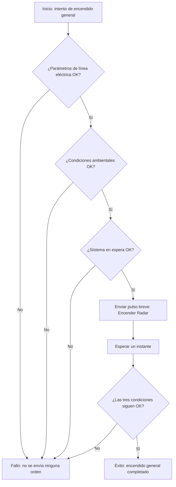

# Rutinas de control del radar

Esta página describe, en lenguaje operativo (no de programación), cómo el software del RCP
enciende y controla el radar paso a paso. Está pensada para que alguien con experiencia operando
el radar real (product expert) pueda revisar si la secuencia es correcta, aunque no lea código.

El plan del proyecto define **seis rutinas de control**: encendido general, encendido del
transmisor, encendido del receptor analógico, encendido de la unidad de antena, movimiento de
antena y posicionamiento de antena. Cada una automatiza una secuencia que, en el radar original,
hacía el operador a mano desde el panel de control.

!!! danger "Por qué esta página existe"
    El plan del proyecto nombra las seis rutinas pero **no fija el procedimiento interno de
    ninguna** — eso es responsabilidad de este equipo, no algo copiado de un manual del
    fabricante. Cada rutina de esta página necesita revisión de alguien que conozca el
    procedimiento real antes de confiar en ella para algo más que pruebas contra el simulador.

## Rutina 1 — Encendido general del radar

**Estado:** implementada y probada contra el simulador del radar. No probada contra hardware
real.

### Qué revisa antes de encender

Antes de intentar el encendido, el sistema comprueba que estas tres condiciones estén en buen
estado:

1. **Parámetros de línea eléctrica correctos** (señal `sys.line_parameters_ok_status`).
2. **Condiciones ambientales correctas** (señal `sys.environment_ok_status`).
3. **Sistema en espera (standby) correcto** (señal `sys.standby_system_ok_status`).

Si **cualquiera** de las tres no está en buen estado, el sistema **no envía ninguna orden** al
radar y reporta el intento como fallido.

### Qué hace al encender

Si las tres condiciones están bien, el sistema envía una orden breve de "Encender Radar" — como
pulsar un botón momentáneamente, no como sostener un interruptor. Esto es así porque, según la
documentación del equipo de simulación, el radar interpreta esta orden como un pulso (una
presión de botón), no como un nivel sostenido: si dos órdenes opuestas ("Encender" / "Apagar")
estuvieran activas a la vez, gana apagar, por seguridad.

### Cómo se determina si funcionó

Después de enviar el pulso, el sistema espera un instante y vuelve a revisar las mismas tres
condiciones. Si siguen bien, considera el encendido exitoso.

!!! question "Para el experto: revisar antes de confiar en esta rutina"
    - ¿Es correcto el conjunto de estas tres condiciones, y en este orden, para el procedimiento
      real de encendido general? Se dedujeron de los nombres disponibles en el catálogo de
      señales del radar, no de un manual ni de un procedimiento operativo confirmado.
    - ¿Existe, en el radar real, alguna señal de "radar encendido" que debiéramos usar como
      confirmación directa? Hoy no existe ninguna en el catálogo disponible — el éxito se infiere
      de que las tres condiciones de arriba "sigan bien" después del pulso, no de una lectura que
      diga explícitamente "encendido".

### Diagrama de la secuencia

## Rutinas 2 a 6 — todavía no implementadas

| Rutina | En qué consiste (procedimiento real) | Estado |
|---|---|---|
| Encendido del transmisor | Enciende sopladores, fuentes de alimentación y alta tensión del transmisor, respetando los enclavamientos de seguridad (interlocks) y el tiempo de calentamiento. | No implementada |
| Encendido del receptor analógico | Enciende el front-end de recepción (RFE) y confirma que el oscilador local esté enganchado (locked). | No implementada |
| Encendido de la unidad de antena | Habilita la unidad motriz de la antena. | No implementada |
| Movimiento de antena | Mueve la antena en azimut/elevación a una velocidad dada. | No implementada |
| Posicionamiento de antena | Lleva la antena a una posición exacta de azimut/elevación. | No implementada |

La rutina de encendido del transmisor es la siguiente candidata a implementar: a diferencia de la
de arriba, el simulador del radar sí modela una secuencia interna con tiempos (calentamiento,
etc.), así que su revisión con el experto será más relevante todavía.

## Trazabilidad técnica

Para quien necesite correlacionar esta página con el código: la rutina de la sección 1 vive en
`src/core/control_routines/general_power_on.py`, y la pregunta abierta de arriba está registrada
como `PEND-RCP-06` en [Pendientes](../alcance/pendientes.md#pend-rcp-06-secuencia-y-confirmacion-de-la-rutina-general-radar-power-on-fase-2).
